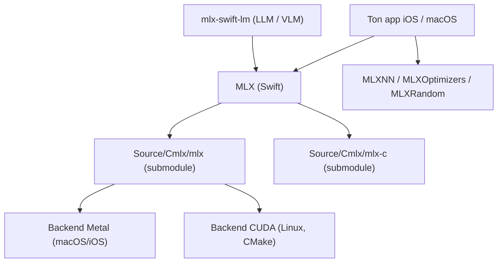

# ml-explore/mlx-swift

> API Swift de MLX, le framework de tableaux pour l'apprentissage machine sur puces Apple.

## Le problème
MLX est en Python ; écrire une app iOS ou macOS qui fait tourner un modèle localement obligeait
à passer par un pont.

## Ce que ça fait vraiment
Porte MLX en Swift pour rendre la recherche et l'expérimentation plus directes sur Apple
silicon. Le paquet expose `MLX`, `MLXNN`, `MLXOptimizers` et `MLXRandom`. Les implémentations
de LLM et VLM vivent dans un dépôt séparé, `mlx-swift-lm`. Les exemples, également hébergés
ailleurs (MLX Swift Examples), couvrent l'entraînement d'un LeNet sur MNIST, une app de chat
LLM/VLM, la génération de texte depuis un modèle Hugging Face, Stable Diffusion, et un outil
en ligne de commande `llm-tool`. Trois voies de construction : Xcode, SwiftPM, ou CMake — cette
dernière offrant une option de build Linux native, avec backend CPU par défaut et backend CUDA
exclusif à Linux.

## Comment c'est branché


## Essayer
```bash
git submodule update --init --recursive
xcodebuild test -scheme mlx-swift-Package -destination 'platform=OS X'
brew install cmake
brew install ninja
mkdir -p build && cd build && cmake .. -G Ninja && ninja && ./tutorial
cmake -DMLX_BUILD_METAL=OFF -DMLX_BUILD_CUDA=ON -DMLX_C_BUILD_EXAMPLES=OFF .. -G Ninja
```

## Coût et pièges
Gratuit. **SwiftPM en ligne de commande ne sait pas compiler les shaders Metal** : la
construction finale doit passer par Xcode ou `xcodebuild`. Piège documenté : si ton app et un
framework intermédiaire lient tous deux MLX, tu te retrouves avec deux copies de MLX dans le
même processus, d'où le projet `xcode/MLX.xcodeproj` pour le construire en Framework.

## Ce que ce n'est pas
Ce n'est pas une bibliothèque de modèles : les LLM et VLM sont ailleurs. Ce n'est pas non plus
un portage partiel — le README affirme que toutes les capacités de MLX Python devraient être
disponibles, et invite à ouvrir une issue sinon. Les exemples ne sont pas dans ce dépôt.

## Alternatives
- MLX (Python), pour tout ce qui n'a pas besoin d'être embarqué dans une app Apple.
- `mlx-swift-lm`, si ce que tu cherches ce sont les modèles de langage.

## Pour toi
Hors sujet sous Linux ; pertinent seulement si tu embarques de l'inférence dans une app Apple.
