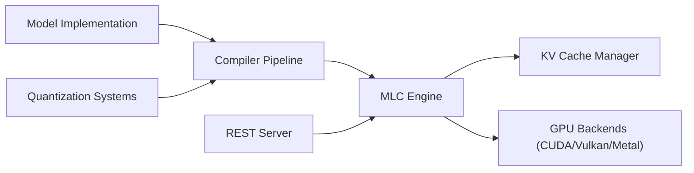

# mlc-ai/mlc-llm

> Compilateur et moteur d'inférence pour déployer des LLM nativement sur GPU, mobile et navigateur.

## Le problème
Faire tourner un même LLM sur CUDA, Metal, Vulkan, WebGPU, iOS et Android impose une pile différente par cible et beaucoup d'optimisation manuelle.

## Ce que ça fait vraiment
Compile le modèle via un pipeline ML (TensorIR, passes d'optimisation) vers chaque plateforme.
Exécute le résultat sur MLCEngine, qui expose une API compatible OpenAI : serveur REST, Python, JavaScript, iOS, Android.
Gère quantification, tokenizers et cache KV (architecture).
Le README est court : l'installation et le démarrage sont renvoyés à la documentation.

## Comment c'est branché

## Essayer
Aucune commande documentée dans le README : il renvoie aux pages Installation et Quick start.

## Coût et pièges
Gratuit, mais il faut un GPU (ou un appareil mobile / navigateur WebGPU). La compilation par cible ajoute une étape absente des moteurs classiques.

## Ce que ce n'est pas
Pas un outil d'entraînement. Pas un simple `pip install` qui marche partout : chaque plateforme a ses contraintes. Le README ne donne ni chiffres ni exemple exécutable.

## Alternatives
Aucune alternative nommée dans le README.

## Pour toi
À surveiller : pertinent si tu dois embarquer un LLM sur mobile ou navigateur ; pour du serving serveur classique, la matière du README ne suffit pas à trancher.
