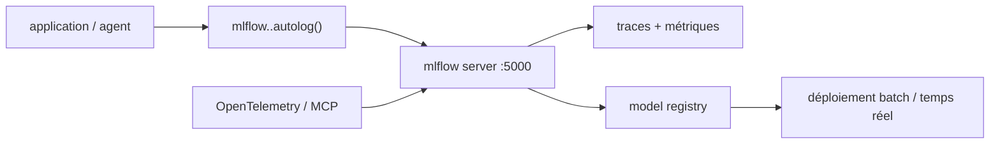

# mlflow/mlflow

> Plateforme ouverte pour tracer, évaluer et déployer modèles, LLM et agents.

## Le problème
Les traces d'un agent vivent dans les logs de chaque framework, sans vue commune ni comparaison possible.
Retrouver quel jeu de paramètres a produit quel modèle, six mois plus tard, relève de l'archéologie.

## Ce que ça fait vraiment
Un serveur local (`mlflow server`) collecte traces et métriques, consultables dans une UI sur `localhost:5000`.
Traçage automatique en une ligne pour plus de 60 frameworks (LangChain, LangGraph, DSPy, CrewAI, LlamaIndex, OpenAI Agents…), en Python, TypeScript, Java.
Côté modèles classiques : suivi d'expériences, évaluation, registre de modèles, déploiement Docker/Kubernetes/SageMaker/Azure ML.
Côté LLM : observabilité, évaluation, gestion et optimisation de prompts, passerelle IA pour contrôler coûts et accès.

## Comment c'est branché


## Essayer
```bash
uvx mlflow server
curl -LsSf https://mlflow.org/wizard/setup.sh | sh
```

## Coût et pièges
Gratuit et neutre côté fournisseur ; le serveur local ne demande ni clé ni compte.
L'assistant d'installation télécharge et exécute un script distant, puis lance ton agent de code sur ton dépôt.

## Ce que ce n'est pas
Ce n'est pas une offre gérée : l'hébergement (local, on-premise, Databricks, SageMaker, Azure ML, Nebius, OpenShift AI) reste ton problème.
Ce n'est pas un outil d'entraînement : il observe, évalue et versionne, il ne calcule pas.
Le tracing n'est pas magique : l'autolog couvre les frameworks listés, le reste demande de l'instrumentation.

## Alternatives
Langfuse, Arize/Phoenix : cités comme outils intégrés, ils couvrent aussi l'observabilité LLM.
LiteLLM Proxy, OpenRouter, Portkey : passerelles alternatives si seul le contrôle des coûts t'intéresse.

## Pour toi
Le socle par défaut pour tracer agents et expériences : commence par `uvx mlflow server` et un `autolog()`.
