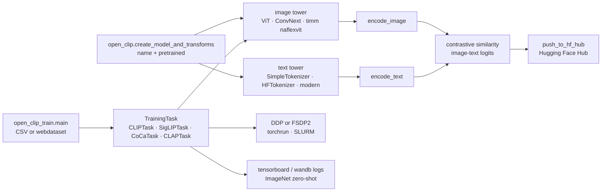

# mlfoundations/open_clip

> **An open implementation of CLIP: load pretrained image-text models, or train your own.**

## The problem

Without it, using a contrastive image-text encoder means going back to OpenAI's original
repository, limited to a handful of published weights, with no distributed training code and no
common interface across model families. Every new variant — SigLIP, CoCa, DFN, PE, CLAP audio —
ships its own loader, its own tokenization conventions and its own checkpoint format.

## What it actually does

- One loading interface: `open_clip.create_model_and_transforms(name, pretrained=tag)` returns
  the model and image transforms, with `get_tokenizer` giving the matching tokenizer.
  `open_clip.list_pretrained()` enumerates what is available; `pretrained` also accepts a local
  path or a file downloaded from the Hugging Face Hub.
- A catalogue of trained weights covering ConvNext, ViT up to bigG-14, plus external families
  reloadable through the same API (SigLIP, SigLIP2, DFN, PE, OpenAI's original CLIP). The README
  publishes their ImageNet-1k zero-shot accuracy, from 71.5% to 85.4%.
- The training code itself: `python -m open_clip_train.main`, CSV or webdataset inputs, DDP or
  FSDP2, three `torch.compile` strategies, gradient accumulation, distillation from a teacher
  model, and resuming from a checkpoint including one on S3.
- Built-in zero-shot evaluation (`--imagenet-val`, `--audio-zeroshot-dataset`), caption
  generation for CoCa and MaMMUT (`model.generate(im)`), and publishing models to the Hub
  (`python -m open_clip.push_to_hf_hub`).
- What it does **not** handle itself: building datasets (img2dataset), systematic evaluation
  over 40 tasks (CLIP_benchmark), and bulk embedding computation (clip-retrieval) — all
  delegated to third-party repositories named in the README.

## How it is wired



No code-derived diagram exists for this repository: this sketch is rebuilt from the README
alone. The point to keep is the split between the inference path (`open_clip`, stable) and the
training path (`open_clip_train`, rebuilt around `TrainingTask`).

## Trying it

```bash
pip install open_clip_torch
```

```python
import torch
from PIL import Image
import open_clip

model, _, preprocess = open_clip.create_model_and_transforms('ViT-B-32', pretrained='laion2b_s34b_b79k')
model.eval()  # model in train mode by default, impacts some models with BatchNorm or stochastic depth active
tokenizer = open_clip.get_tokenizer('ViT-B-32')

image = preprocess(Image.open("docs/CLIP.png")).unsqueeze(0)
text = tokenizer(["a diagram", "a dog", "a cat"])

with torch.no_grad(), torch.autocast("cuda"):
    image_features = model.encode_image(image)
    text_features = model.encode_text(text)
    image_features /= image_features.norm(dim=-1, keepdim=True)
    text_features /= text_features.norm(dim=-1, keepdim=True)

    text_probs = (100.0 * image_features @ text_features.T).softmax(dim=-1)

print("Label probs:", text_probs)  # prints: [[1., 0., 0.]]
```

For training, the README first creates a dedicated environment, then installs the `training`
extra:

```bash
python3 -m venv .env
source .env/bin/activate
pip install -U pip
```

```bash
cd open_clip/src
torchrun --nproc_per_node 4 -m open_clip_train.main \
    --train-data '/data/cc12m/cc12m-train-{0000..2175}.tar' \
    --train-num-samples 10968539 \
    --dataset-type webdataset \
    --batch-size 320 \
    --precision amp \
    --workers 4 \
    --imagenet-val /data/imagenet/validation/
```

## Cost and gotchas

- **No API key, no paid service**: package and weights are freely downloadable. The real cost is
  compute.
- **GPU**: inference with a ViT-B-32 fits on a modest machine, but the README states training was
  "battle tested up to 1024 A100s" and gives a SLURM script over 32 nodes of 4 GPUs. The tabled
  models saw 13 to 86 billion samples — out of reach for a single machine. Per-model VRAM is not
  documented.
- **Torch >= 2.6 required** on `main` (was >= 2.0). A recent bump, worth checking before
  upgrading.
- **The `main` branch breaks the training API**: `--horovod`, `--torchscript` and `--trace`
  removed, `--precision` silently changed from `amp` to `amp_bf16`, `train_one_epoch` now expects
  a `TrainingTask`, data batches are dicts rather than tuples. The README explicitly recommends
  pinning the `v3` branch or a 3.x PyPI release for the stable training API. Inference usage
  stays compatible.
- **The QuickGELU trap**: many older checkpoints use it while the default moved to `nn.GELU`;
  without the `-quickgelu` suffix in the model name you silently lose accuracy.
- **Side dependencies**: an up-to-date `timm` for convnext/siglip/eva encoders, `transformers`
  for HF tokenizers, `datasets[audio] torchaudio torchlibrosa` for CLAP.
- **The measured int8 path disappoints on speed**: the README reports 53.9 ms in fp16 against
  56.9 ms in int8 for a batch of 128 — 5.6% *slower*. The gain is memory (roughly 2x on the
  quantized layers), not throughput. The older `SwitchBackLinear`/triton path is declared
  unusable on a fresh install.
- **Licence recorded as `NOASSERTION`** by the catalogue: GitHub could not identify the licence
  file, and part of the modelling code is adapted from OpenAI's repository. Check `LICENSE`
  before any internal use.

## What it is not

- **Not an image search engine or a vector store**: you get normalized vectors, not an index. The
  README points to `clip-retrieval` for scale.
- **Not a supervised fine-tuning tool**: the repository focuses on contrastive pretraining and
  explicitly redirects to `wise-ft` for fine-tuning a zero-shot model on a downstream
  classification task.
- **Not a data provider**: LAION, DataComp, YFCC and CC3M are not shipped; you assemble them
  yourself as webdataset `.tar` shards of paired images and texts, typically via `img2dataset`.
- **Not a stable API right now**: `main` is in an acknowledged refactor, with model families
  labelled "new / experimental" (NaFlex, GenLIP, MaMMUT, the "modern" text tower).

## Alternatives

| | When to prefer it |
|---|---|
| **openai/CLIP** | The original repository, named in the README (OpenCLIP adapts part of its modelling and tokenizer code). Prefer it if you strictly want OpenAI's weights and nothing else; OpenCLIP loads them anyway, with many more families alongside. |
| **mlfoundations/wise-ft** | The README's explicit redirect for fine-tuning a zero-shot model on a downstream classification task, which is out of OpenCLIP's scope. |
| **LAION-AI/CLIP_benchmark** | Recommended by the README for systematic evaluation over 40 datasets: use it *with* OpenCLIP, not instead of it, as soon as models must be compared seriously. |

The catalogue neighbours (`roboflow/supervision`, `d2l-ai/d2l-en`,
`svc-develop-team/so-vits-svc`, `opengeos/geoai`) are not comparable: none provides a
contrastive image-text training implementation.

## For you

Adopt it — it is probably already a transitive dependency somewhere. This is the reference
loader for anything touching image-text embeddings: multimodal search, zero-shot labelling,
corpus filtering, pre-encoding for a downstream pipeline. One line gets you inference. Do not,
however, plan an in-house pretraining run: the documented scale (tens of billions of samples
seen, hundreds of GPUs) says the value sits in the published weights, not the training code —
unless you have a cluster and a precise reason to retrain one.
