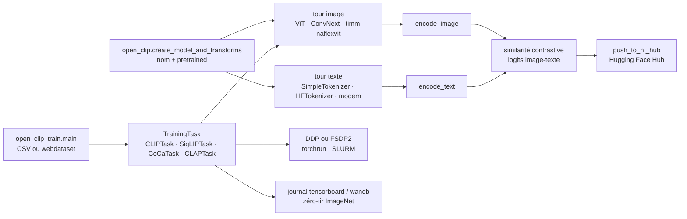

# mlfoundations/open_clip

> **Implémentation ouverte de CLIP : charger des modèles image-texte pré-entraînés, ou en entraîner.**

## Le problème

Sans elle, exploiter un encodeur image-texte contrastif revient à reprendre le dépôt d'origine
d'OpenAI, limité à quelques poids publiés, sans code d'entraînement distribué ni interface
commune entre familles de modèles. Chaque nouvelle variante — SigLIP, CoCa, DFN, PE, CLAP audio —
arrive avec son propre chargeur, ses propres conventions de tokenisation et son propre format
de points de contrôle.

## Ce que ça fait vraiment

- Une interface unique de chargement : `open_clip.create_model_and_transforms(nom, pretrained=tag)`
  rend le modèle, les transformations d'image et, via `get_tokenizer`, le tokeniseur assorti.
  `open_clip.list_pretrained()` énumère ce qui est disponible ; `pretrained` accepte aussi un
  chemin local ou un fichier téléchargé depuis le Hugging Face Hub.
- Un catalogue de poids déjà entraînés couvrant ConvNext, ViT jusqu'à bigG-14, et les familles
  externes rechargeables par la même API (SigLIP, SigLIP2, DFN, PE, CLIP original d'OpenAI).
  Le README publie leur exactitude zéro-tir sur ImageNet-1k, de 71,5 % à 85,4 %.
- Le code d'entraînement lui-même : `python -m open_clip_train.main`, données CSV ou webdataset,
  DDP ou FSDP2, `torch.compile` en trois stratégies, accumulation de gradient, distillation
  depuis un modèle enseignant, reprise depuis un point de contrôle y compris sur S3.
- L'évaluation zéro-tir intégrée (`--imagenet-val`, `--audio-zeroshot-dataset`), la génération
  de légendes pour CoCa et MaMMUT (`model.generate(im)`), et la publication de modèles vers le
  Hub (`python -m open_clip.push_to_hf_hub`).
- Ce qu'il **n'inspecte pas lui-même** : les jeux de données (img2dataset), l'évaluation
  systématique sur 40 tâches (CLIP_benchmark), le calcul d'embeddings de masse (clip-retrieval),
  tous délégués à des dépôts tiers nommés dans le README.

## Comment c'est branché



Aucun diagramme tiré du code n'existe pour ce dépôt : ce schéma est reconstruit depuis le seul
README. Le point à retenir est la séparation entre la voie d'inférence (`open_clip`, stable) et
la voie d'entraînement (`open_clip_train`, refondue autour des `TrainingTask`).

## Essayer

```bash
pip install open_clip_torch
```

```python
import torch
from PIL import Image
import open_clip

model, _, preprocess = open_clip.create_model_and_transforms('ViT-B-32', pretrained='laion2b_s34b_b79k')
model.eval()  # model in train mode by default, impacts some models with BatchNorm or stochastic depth active
tokenizer = open_clip.get_tokenizer('ViT-B-32')

image = preprocess(Image.open("docs/CLIP.png")).unsqueeze(0)
text = tokenizer(["a diagram", "a dog", "a cat"])

with torch.no_grad(), torch.autocast("cuda"):
    image_features = model.encode_image(image)
    text_features = model.encode_text(text)
    image_features /= image_features.norm(dim=-1, keepdim=True)
    text_features /= text_features.norm(dim=-1, keepdim=True)

    text_probs = (100.0 * image_features @ text_features.T).softmax(dim=-1)

print("Label probs:", text_probs)  # prints: [[1., 0., 0.]]
```

Pour entraîner, le README passe par un environnement dédié puis l'extra `training` :

```bash
python3 -m venv .env
source .env/bin/activate
pip install -U pip
```

```bash
cd open_clip/src
torchrun --nproc_per_node 4 -m open_clip_train.main \
    --train-data '/data/cc12m/cc12m-train-{0000..2175}.tar' \
    --train-num-samples 10968539 \
    --dataset-type webdataset \
    --batch-size 320 \
    --precision amp \
    --workers 4 \
    --imagenet-val /data/imagenet/validation/
```

## Coût et pièges

- **Aucune clé d'API, aucun service payant** : le paquet et les poids sont librement
  téléchargeables. Le coût réel est le calcul.
- **GPU** : l'inférence d'un ViT-B-32 tient sur une machine modeste, mais le README précise que
  l'entraînement a été « éprouvé jusqu'à 1024 A100 » et donne un script SLURM sur 32 nœuds de
  4 GPU. Les modèles du tableau ont vu de 13 à 86 milliards d'échantillons : hors de portée
  d'une machine seule. Le README ne chiffre pas la VRAM par modèle.
- **Torch ≥ 2.6 obligatoire** sur `main` (c'était ≥ 2.0). Bump récent, à vérifier avant montée
  de version.
- **La branche `main` casse l'API d'entraînement** : `--horovod`, `--torchscript`, `--trace`
  supprimés, `--precision` passé silencieusement de `amp` à `amp_bf16`, `train_one_epoch` attend
  désormais une `TrainingTask`, les lots de données sont des dictionnaires et non des tuples.
  Le README recommande explicitement d'épingler la branche `v3` ou une version 3.x de PyPI pour
  l'API d'entraînement stable. L'inférence, elle, reste compatible.
- **Piège des poids QuickGELU** : beaucoup de points de contrôle anciens l'utilisent alors que
  le défaut est passé à `nn.GELU` ; sans le suffixe `-quickgelu` dans le nom du modèle, on perd
  de l'exactitude sans erreur visible.
- **Dépendances annexes** : `timm` à jour pour les encodeurs convnext/siglip/eva, `transformers`
  pour les tokeniseurs HF, `datasets[audio] torchaudio torchlibrosa` pour CLAP.
- **La voie int8 mesurée est décevante côté vitesse** : le README relève 53,9 ms en fp16 contre
  56,9 ms en int8 par lot de 128 — 5,6 % *plus lent*. Le gain est mémoire (≈ 2x sur les couches
  quantifiées), pas débit. L'ancienne voie `SwitchBackLinear`/triton est déclarée inutilisable
  sur une installation fraîche.
- **Licence relevée `NOASSERTION`** par le catalogue : GitHub n'a pas su identifier le fichier de
  licence, et une partie du code de modélisation est reprise du dépôt d'OpenAI. À lever sur le
  `LICENSE` avant tout usage interne.

## Ce que ce n'est pas

- **Ce n'est pas un moteur de recherche d'images ni une base vectorielle** : on obtient des
  vecteurs normalisés, pas un index. Le README renvoie à `clip-retrieval` pour le passage à
  l'échelle.
- **Ce n'est pas un outil de mise au point supervisée** : le dépôt est centré sur le
  pré-entraînement contrastif et renvoie explicitement à `wise-ft` pour affiner un modèle
  zéro-tir sur une tâche de classification.
- **Ce n'est pas un fournisseur de données** : les jeux LAION, DataComp, YFCC, CC3M ne sont pas
  livrés ; il faut les constituer soi-même en webdataset (`.tar` d'images et de textes appariés)
  via `img2dataset`.
- **Ce n'est pas une API stable en ce moment** : la branche `main` est en refonte assumée, avec
  des familles de modèles annoncées « new / experimental » (NaFlex, GenLIP, MaMMUT, tour texte
  « modern »).

## Alternatives

| | Quand le préférer |
|---|---|
| **openai/CLIP** | Le dépôt d'origine, nommé dans le README (dont OpenCLIP adapte une partie du code de modélisation et de tokenisation). À préférer si l'on veut strictement les poids d'OpenAI et rien d'autre ; OpenCLIP les charge de toute façon, avec bien plus de familles en prime. |
| **mlfoundations/wise-ft** | Renvoi explicite du README pour la mise au point d'un modèle zéro-tir sur une tâche de classification en aval, hors périmètre d'OpenCLIP. |
| **LAION-AI/CLIP_benchmark** | Recommandé par le README pour l'évaluation systématique sur 40 jeux de données : à utiliser *avec* OpenCLIP, pas à sa place, dès qu'il faut comparer des modèles sérieusement. |

Les voisins du catalogue (`roboflow/supervision`, `d2l-ai/d2l-en`,
`svc-develop-team/so-vits-svc`, `opengeos/geoai`) ne sont pas comparables : aucun n'offre
d'implémentation d'entraînement contrastif image-texte.

## Pour toi

À adopter, et probablement déjà présent en dépendance transitive quelque part : c'est le
chargeur de référence pour tout ce qui touche aux embeddings image-texte — recherche
multimodale, étiquetage zéro-tir, filtrage de corpus, pré-encodage pour un pipeline en aval.
Une ligne suffit pour l'inférence. En revanche, ne planifie pas un pré-entraînement maison :
l'échelle documentée (des dizaines de milliards d'échantillons vus, des centaines de GPU) dit
que la valeur est du côté des poids publiés, pas du côté du code d'entraînement — sauf à avoir
un cluster et une raison précise d'en réentraîner un.
