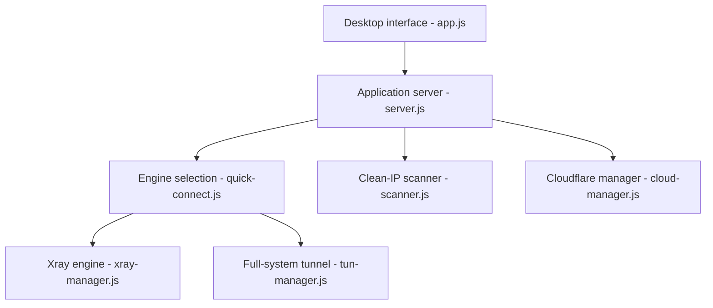

# mlmvpn/mlmvpn_windows

> Application Windows regroupant quatorze moteurs anti-censure, un scanner d'IP propres et un gestionnaire Cloudflare.

## Le problème
Aucun transport ne passe partout dans les réseaux filtrés : il faut en essayer plusieurs et savoir lequel fonctionne ici et maintenant.

## Ce que ça fait vraiment
Application Electron avec serveur Express local qui pilote des moteurs externes (Xray-core, sing-box, WARP, Psiphon, Tor, Lantern, Geph, OpenVPN…), mesure latence et débit, route par application ou en tunnel complet, avec coupe-circuit et garde DNS. Un scanner cherche des IP CDN saines ; un gestionnaire déploie des Workers Cloudflare avec ton propre jeton. Les binaires des moteurs ne sont pas dans le dépôt.

## Comment c'est branché


## Essayer
```bash
git clone https://github.com/mlmvpn/mlmvpn_windows.git
cd mlmvpn_windows
npm install
npm run electron
npm test
```

## Coût et pièges
Droits administrateur obligatoires (TUN, pare-feu, DNS), Node 18+, environ 1,5 Go. Les binaires de `core/` sont à fournir (docs/BUILD.md). Licence présente mais non identifiée. Compte Cloudflare et jeton API pour la partie cloud.

## Ce que ce n'est pas
Pas un VPN avec serveur propre : le README dit qu'aucun serveur MLMVPN n'est dans le chemin des données. La légalité d'usage est de ta responsabilité.

## Alternatives
Aucune alternative nommée dans le README, qui cite en revanche les projets pilotés (Xray-core, sing-box, Tor, Psiphon).

## Pour toi
À ignorer : outil de contournement de censure sous Windows, sans lien avec le travail data/IA/MLOps, avec un mainteneur unique.

