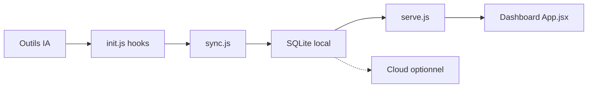

# mm7894215/TokenTracker

> Tableau de bord local de consommation de tokens et de coût pour 39 outils de code IA.

## Le problème
Impossible de savoir combien de tokens et d'argent tes agents de code consomment à travers plusieurs outils.

## Ce que ça fait vraiment
Installe des hooks, parse les logs locaux (jamais les prompts) en tranches UTC de 30 minutes dans SQLite, et sert un tableau de bord sur `localhost:7680`. Coûts via les tarifs LiteLLM (plus de 2 200 modèles), suivi des quotas de plusieurs fournisseurs, applis bureau macOS/Windows/Linux, widgets, mascotte, succès, onglet Skills, classement et synchronisation cloud optionnels.

## Comment c'est branché


## Essayer
```bash
npx tokentracker-cli
npm i -g tokentracker-cli
tokentracker status
tokentracker doctor
```

## Coût et pièges
Gratuit, Node 20+. Télémétrie anonyme active par défaut (désactivable avec `TOKENTRACKER_NO_TELEMETRY=1`). App macOS signée ad hoc, non notariée ; les hooks modifient la config de tes outils.

## Ce que ce n'est pas
Pas un outil d'optimisation de coûts ; les modèles sans tarif publié affichent 0 $.

## Alternatives
ccusage : CLI plus riche en reporting terminal ; Tokscale : TUI multi-agents.

## Pour toi
À adopter pour mesurer ta consommation d'agents de code : local par défaut, couverture large ; coupe la télémétrie.

