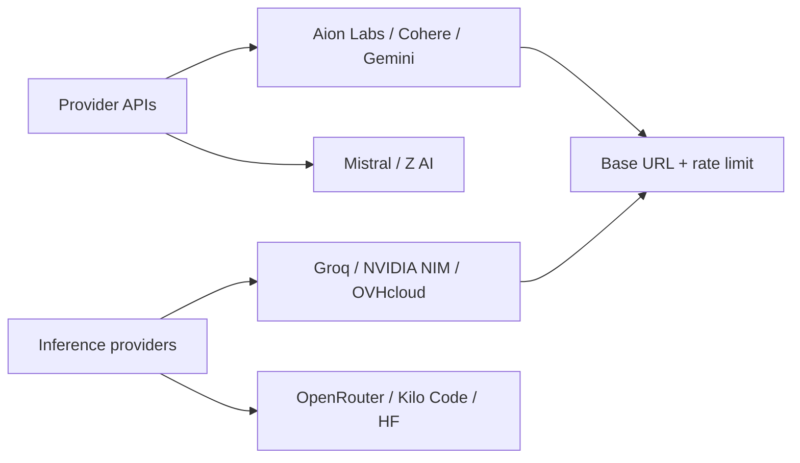

# mnfst/awesome-free-llm-apis

> Catalogue des API de LLM à niveau gratuit, avec contexte, modalités et limites de débit.

## Le problème
Pour prototyper sans budget, il faut savoir qui offre quoi, à quelles limites, et si les prompts
serviront à entraîner le modèle. Cette information est éparpillée et périme vite.

## Ce que ça fait vraiment
Deux tables. D'abord les **fournisseurs** qui entraînent leurs propres modèles : Aion Labs,
Cohere, Google Gemini, Mistral, Z AI. Ensuite les **plateformes d'inférence** qui hébergent des
modèles à poids ouverts : Cloudflare Workers AI, Groq, Hugging Face, Kilo Code, LLM7.io,
ModelScope, NVIDIA NIM, Ollama Cloud, OpenRouter, OVHcloud, SiliconFlow. Pour chacun : URL de
base, nom de modèle, fenêtre de contexte, sortie maximale, modalité, limite RPM/RPD/TPM.
Un glossaire ferme le document.

## Comment c'est branché


## Essayer
```bash
# Rien à installer : les « commandes » sont les URL de base à donner à un SDK
# compatible OpenAI, par exemple https://api.groq.com/openai/v1
# ou https://oai.endpoints.kepler.ai.cloud.ovh.net/v1 (anonyme, 2 RPM).
```

## Coût et pièges
Gratuit au sens des quotas, pas de la confidentialité : les prompts du niveau gratuit Gemini
peuvent servir à améliorer les produits Google, et ceux du mode gratuit Mistral à entraîner leurs
modèles sauf opt-out. Cohere est explicitement non commercial. ModelScope exige un compte Alibaba
Cloud avec vérification d'identité, SiliconFlow une vérification d'identité aussi.

## Ce que ce n'est pas
Ce n'est pas du code : aucune passerelle, aucun client. Ce n'est pas une garantie de
disponibilité — les quotas d'Ollama Cloud ne sont même pas publiés. Une liste comme celle-ci
périme en semaines : vérifie chaque ligne avant de t'y fier.

## Alternatives
Aucune alternative nommée dans le README.

## Pour toi
À garder sous la main pour prototyper gratuitement — jamais pour une donnée sensible.
