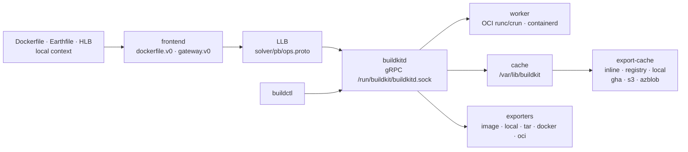

# moby/buildkit

> **The image build engine that runs under `docker build`, usable on its own and scriptable.**

## The problem

Without BuildKit, a Dockerfile is executed instruction by instruction, with no concurrency
between independent branches and a local cache that cannot be exported to a registry or
shared between machines. CI starts from scratch on every run, and the build description is
locked to one language: the Dockerfile.

## What it actually does

BuildKit is a `buildkitd` daemon plus a `buildctl` client talking gRPC. It does not build
Dockerfiles as such: it executes **LLB**, a binary intermediate format marshaled as Protobuf
(defined in `solver/pb/ops.proto`), which the README compares to what LLVM IR is to C — a
concurrently executable, cacheable dependency graph.

Frontends translate a build description into LLB. `dockerfile.v0` ships in the repo;
`gateway.v0` lets any image act as a frontend, which makes the build language replaceable
(the README lists Buildpacks, HLB, Earthfile, Nix, mopy, envd, Blubber, DALEC and more).

Build cache can be exported and imported: `inline`, `registry`, `local`, `gha`, `s3`,
`azblob`, in `min` or `max` mode. That is the feature that changes a CI pipeline.

Results leave through exporters that do not assume a registry: `image`, `local` (files
copied straight to the client, useful when you are building something other than container
images), `tar`, `docker`, `oci`, or the containerd image store. Multi-platform builds,
rootless execution (`docs/rootless.md`), garbage collection and OpenTelemetry traces round
it out.

## How it is wired



No code-derived diagram exists for this repo: the graph above is reconstructed from the
README alone, using the names it cites (`solver/pb/ops.proto`, the default socket, the
frontend and exporter names).

## Trying it

```bash
$ sudo buildkitd
```

```bash
buildctl build \
    --frontend=dockerfile.v0 \
    --local context=. \
    --local dockerfile=.
```

```bash
buildctl build ... --output type=image,name=docker.io/username/image,push=true
buildctl build ... --output type=local,dest=path/to/output-dir
buildctl du -v
buildctl prune
```

In a container, without installing the daemon on the host:

```bash
docker run -d --name buildkitd --privileged moby/buildkit:latest
export BUILDKIT_HOST=docker-container://buildkitd
buildctl build --help
```

Cache shared across CI runs:

```bash
buildctl build ... \
  --output type=image,name=docker.io/username/image,push=true \
  --export-cache type=inline \
  --import-cache type=registry,ref=docker.io/username/image
```

## Cost and gotchas

- **Free, Apache-2.0, no API key for the core.** The cost is operational.
- **The daemon is Linux (and Windows) only**; `buildctl` exists on macOS, `buildkitd` does
  not. The unofficial Homebrew formula ships without the daemon, so macOS needs a Linux VM
  (the README shows Lima).
- **`sudo buildkitd`** by default, or a `--privileged` container. Rootless mode exists but
  is deferred to `docs/rootless.md`. Prerequisites: `runc` or `crun`, plus `containerd` for
  the containerd worker.
- **TCP without mTLS is dangerous** — the README says so plainly: `RUN` containers can then
  call the BuildKit API themselves. Certificates on both ends.
- **Remote cache means a third-party service and a bill.** `gha` is capped at 10 GB shared
  per repo, with eviction and a warning that recycling caches too often slows things down;
  `s3` and `azblob` are marked experimental and authenticate at the **daemon** level, not
  the client.
- **The local cache grows** in `/var/lib/buildkit`: `buildctl du -v`, `buildctl prune`, and
  garbage collection tuned in `buildkitd.toml`.
- **The external frontend is pulled** from Docker Hub (`docker/dockerfile`,
  `docker/dockerfile-upstream`) — a network dependency on a hosted registry.
- **`buildctl` and docker build diverge**: `--export-cache type=inline` requires
  `--build-arg BUILDKIT_INLINE_CACHE=1` under Docker/buildx, but not under `buildctl`.

## What it is not

- **Not a Docker replacement and not a runtime.** BuildKit builds; it does not run
  application containers, manage networking or serve a registry. It leans on runc/crun and
  containerd to execute steps.
- **Not the layer most people should touch directly.** It already sits under `docker build`
  and `docker buildx`, and the README explicitly redirects anyone who just wants
  `RUN --mount=type=cache` to the Dockerfile reference. Installing `buildkitd` separately
  pays off only for a specific need: shared CI, remote cache, a custom frontend, non-image
  output.
- **Not free of security work**: root privileges or a privileged container, a gRPC API to
  protect, and cache credentials held daemon-side.

## Alternatives

| | When to pick it |
|---|---|
| **containerd/containerd** | Named in the README as a possible worker: it is the runtime that executes and stores, not the builder. Complementary rather than competing — pick the containerd worker when you want images to land in its store (`ctr --namespace=buildkit images ls`). |
| **docker/buildx** | Listed under "Used by": the same machinery behind a familiar Docker CLI and managed builders. Better for a workstation or a standard CI; `buildctl` is better when you want the bare daemon, its raw options and no Docker around it. |
| **genuinetools/img, earthly, dagger** | Listed as BuildKit consumers, not competitors: they wrap the same engine behind a different language or workflow. Pick them when the build language is what you want to change, not the engine. |

The remaining catalogue neighbours (`anchore/grype`, `goharbor/harbor`, `docker/compose`)
belong to the same ecosystem but solve other things: vulnerability scanning, registry,
local orchestration.

## For you

This matters mostly on the MLOps side: a training or serving image gets rebuilt twenty times
a day, and cache export/import to a registry or S3 is the lever that turns a ten-minute CI
into a one-minute one. The underrated detail is `--output type=local` — you can use BuildKit
as a reproducible executor that returns *files* (artifacts, test reports) without producing
an image at all. Adopt it with eyes open: in practice you use it through `docker buildx`,
and you only run a bare `buildkitd` if you accept owning a privileged daemon.
