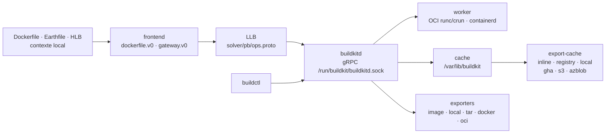

# moby/buildkit

> **Le moteur de construction d'images qui tourne sous `docker build`, utilisable seul et pilotable.**

## Le problème

Construire une image sans BuildKit, c'est exécuter les instructions d'un Dockerfile à la
file, sans parallélisme entre branches indépendantes, avec un cache local qu'on ne peut ni
exporter vers un registre ni partager entre machines — donc une CI qui repart de zéro à
chaque exécution, et un format de description figé à celui du Dockerfile.

## Ce que ça fait vraiment

BuildKit est un couple `buildkitd` (démon) / `buildctl` (client) qui parle gRPC. Il ne
construit pas des Dockerfiles : il exécute du **LLB**, un format intermédiaire binaire
sérialisé en Protobuf (défini dans `solver/pb/ops.proto`) que le README compare à ce qu'est
LLVM IR pour le C — graphe de dépendances concurrent et cacheable.

Les *frontends* traduisent une description de build en LLB. `dockerfile.v0` est livré dans
le dépôt ; `gateway.v0` permet d'utiliser n'importe quelle image comme frontend, ce qui rend
le langage de build remplaçable (le README liste Buildpacks, HLB, Earthfile, Nix, mopy,
envd, Blubber, DALEC…).

Le cache de build s'exporte et s'importe : `inline` (dans l'image), `registry`, `local`,
`gha`, `s3`, `azblob`, avec des modes `min`/`max`. C'est la fonction qui change une CI.

Les résultats sortent par *exporters* indépendants du registre : `image`, `local` (fichiers
copiés chez le client — utile pour construire autre chose que des images), `tar`, `docker`,
`oci`, ou le magasin d'images containerd. Builds multi-plateformes, exécution sans
privilèges root (`docs/rootless.md`), collecte des déchets, traces OpenTelemetry.

## Comment c'est branché



Aucun diagramme tiré du code n'existe pour ce dépôt : ce schéma est reconstruit depuis le
seul README, avec les noms qu'il cite (`solver/pb/ops.proto`, la socket par défaut, les noms
de frontends et d'exporters).

## Essayer

```bash
$ sudo buildkitd
```

```bash
buildctl build \
    --frontend=dockerfile.v0 \
    --local context=. \
    --local dockerfile=.
```

```bash
buildctl build ... --output type=image,name=docker.io/username/image,push=true
buildctl build ... --output type=local,dest=path/to/output-dir
buildctl du -v
buildctl prune
```

En conteneur, sans installer le démon sur l'hôte :

```bash
docker run -d --name buildkitd --privileged moby/buildkit:latest
export BUILDKIT_HOST=docker-container://buildkitd
buildctl build --help
```

Cache partagé entre exécutions de CI :

```bash
buildctl build ... \
  --output type=image,name=docker.io/username/image,push=true \
  --export-cache type=inline \
  --import-cache type=registry,ref=docker.io/username/image
```

## Coût et pièges

- **Gratuit, Apache-2.0, aucune clé d'API pour le cœur.** Le coût est opérationnel.
- **Le démon est Linux (et Windows) uniquement** ; `buildctl` existe sur macOS, pas
  `buildkitd`. Sur macOS, la formule Homebrew « non officielle » ne contient pas le démon :
  il faut une VM Linux (le README montre Lima).
- **`sudo buildkitd`** par défaut, ou le conteneur `--privileged`. Le mode sans root existe
  mais renvoie à `docs/rootless.md`. Prérequis : `runc` ou `crun`, plus `containerd` pour le
  worker containerd.
- **TCP sans mTLS est dangereux** : le README l'écrit noir sur blanc — les conteneurs `RUN`
  peuvent alors appeler l'API BuildKit eux-mêmes. Certificats des deux côtés.
- **Cache distant = service tiers et facture.** `gha` est plafonné à 10 Go partagés par
  dépôt, avec éviction et « recycler trop souvent peut ralentir » ; `s3` et `azblob` sont
  marqués expérimentaux et s'authentifient **au niveau du démon**, pas du client.
- **Le cache local grossit** dans `/var/lib/buildkit` : `buildctl du -v`, `buildctl prune`,
  et la collecte des déchets à régler dans `buildkitd.toml`.
- **Le frontend externe se télécharge** depuis Docker Hub (`docker/dockerfile`,
  `docker/dockerfile-upstream`) : une dépendance réseau à un registre hébergé.
- **Divergence `buildctl` / docker build** : `--export-cache type=inline` exige
  `--build-arg BUILDKIT_INLINE_CACHE=1` côté Docker/buildx, pas côté `buildctl`.

## Ce que ce n'est pas

- **Ce n'est pas un remplaçant de Docker ni un runtime.** BuildKit construit ; il ne fait pas
  tourner de conteneurs applicatifs, ne gère pas de réseau, ne sert pas de registre. Il
  s'appuie sur runc/crun et containerd pour exécuter les étapes.
- **Ce n'est pas la couche que la plupart des gens utilisent directement.** Elle est déjà
  sous `docker build` et sous `docker buildx` ; le README renvoie explicitement à la
  référence Dockerfile pour qui cherche juste `RUN --mount=type=cache`. Installer
  `buildkitd` séparément ne se justifie que pour un besoin propre : CI mutualisée, cache
  distant, frontend maison, sortie non-image.
- **Ce n'est pas indolore côté sécurité** : privilèges root ou conteneur privilégié, API
  gRPC à protéger, credentials de cache stockés côté démon.

## Alternatives

| | Quand le préférer |
|---|---|
| **containerd/containerd** | Nommé dans le README comme worker possible : c'est le runtime qui exécute et stocke, pas le constructeur. Complémentaire plutôt qu'alternatif — on choisit le worker containerd quand on veut que les images atterrissent dans son magasin (`ctr --namespace=buildkit images ls`). |
| **docker/buildx** | Cité dans « Used by » : la même mécanique, mais pilotée par une CLI Docker familière et des *builders* gérés. À préférer pour un poste de développement ou une CI standard ; `buildctl` à préférer quand on veut le démon nu, ses options brutes et pas de Docker autour. |
| **genuinetools/img, earthly, dagger** | Cités comme consommateurs de BuildKit, pas comme concurrents : ils empaquettent le même moteur derrière un langage ou un flux de travail différent. À préférer si c'est le langage de build qu'on cherche à changer, pas le moteur. |

Les autres voisins du catalogue (`anchore/grype`, `goharbor/harbor`, `docker/compose`)
touchent au même écosystème mais résolvent autre chose : scan de vulnérabilités,
registre, orchestration locale.

## Pour toi

Ça compte surtout pour la partie MLOps du métier : une image d'entraînement ou de service se
reconstruit vingt fois par jour, et l'export/import de cache vers un registre ou S3 est le
levier qui fait passer une CI de dix minutes à une. Le mode sortie `type=local` est le détail
sous-estimé — on peut se servir de BuildKit comme d'un exécuteur reproductible qui rend des
*fichiers* (artefacts, rapports de tests) sans produire d'image. À adopter en connaissance de
cause : on l'utilise presque toujours via `docker buildx`, et on ne déploie `buildkitd` nu
que si l'on assume le démon privilégié et son exploitation.
