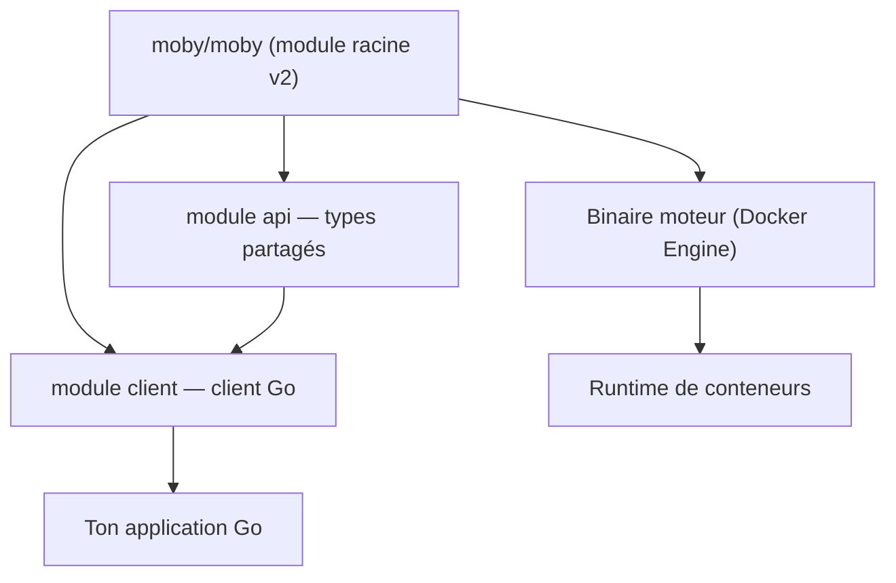

# moby/moby

> Le socle open source de Docker Engine : composants à assembler pour bâtir son propre runtime.

## Le problème
Construire un système de conteneurs maison oblige à réécrire le build, le registre, le runtime. Moby fournit ces briques déjà éprouvées.

## Ce que ça fait vraiment
Un « jeu de Lego » : outils de build, registre, orchestration, runtime, assemblables en systèmes de conteneurs. Docker Engine en est le principal consommateur. Depuis Docker v29 (novembre 2025) le module Go `github.com/docker/docker` est déprécié ; les modules publics supportés sont `github.com/moby/moby/client` et `github.com/moby/moby/api`, versionnés indépendamment. Le module racine `v2` produit des binaires et n'est pas une bibliothèque.

## Comment c'est branché


## Essayer
```diff
- import "github.com/docker/docker/client"
+ import "github.com/moby/moby/client"
```

## Coût et pièges
Gratuit, Apache 2.0. Le README prévient que l'usage et le transfert peuvent tomber sous des restrictions d'exportation américaines. Les tags `docker-vX` ne doivent pas être consommés via `go get`.

## Ce que ce n'est pas
Pas un produit supporté commercialement : pour ça, Docker Desktop ou Mirantis Container Runtime. Pas un lieu de support ni de demandes de fonctionnalités pour les produits Docker. Le module racine n'offre aucune garantie de stabilité d'API.

## Alternatives
- Docker Desktop / Mirantis Container Runtime : si tu veux du support commercial.
- prometheus/common, client-golang (cités ailleurs) : modèle de dépôt pensé comme bibliothèque.

## Pour toi
À surveiller : utile si ton code Go pilote Docker — la migration d'import est la seule action concrète à prévoir.
