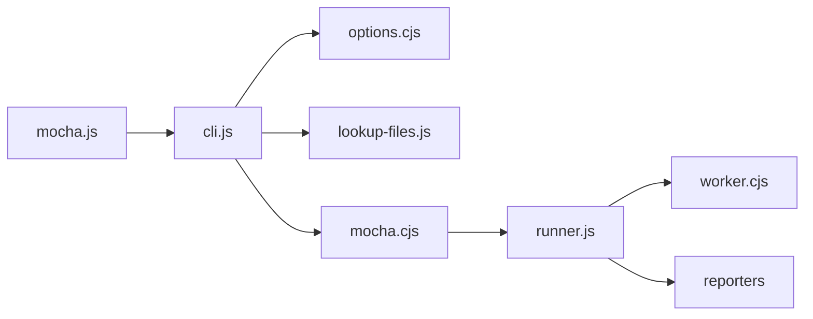

# mochajs/mocha

> Framework de tests JavaScript pour Node.js et navigateur, pour développeurs JS qui veulent un runner configurable.

## Le problème
Écrire et lancer des tests JS demande un runner qui découvre les fichiers, structure les suites et affiche les résultats.

## Ce que ça fait vraiment
Un CLI (ou une API JS) charge les options, trouve les fichiers de test, puis les interfaces définissent suites et tests. Le runner exécute et les reporters affichent. Le mode parallèle répartit les fichiers sur des processus workers ; une entrée navigateur existe. Le README fourni ne contient que des liens (doc, Discord, contribution) : l'usage est décrit ailleurs.

## Comment c'est branché


## Essayer
```bash
# Aucune commande d'installation ni d'usage dans le README fourni
# (il renvoie vers la documentation en ligne).
```

## Coût et pièges
Gratuit. Maintenu exclusivement par des bénévoles, d'après le README : le rythme dépend de leur disponibilité. 222 issues ouvertes.

## Ce que ce n'est pas
Pas un runner « tout-en-un » : assertions et mocks sont à ajouter soi-même. Le README fourni n'explique pas le fonctionnement.

## Alternatives
Aucune alternative nommée dans le README.

## Pour toi
Utile surtout si tu as du code Node/JS à tester (outils, front de dashboards) ; pour du Python data, hors sujet. Très installé, donc sûr à adopter dans ce cas.

