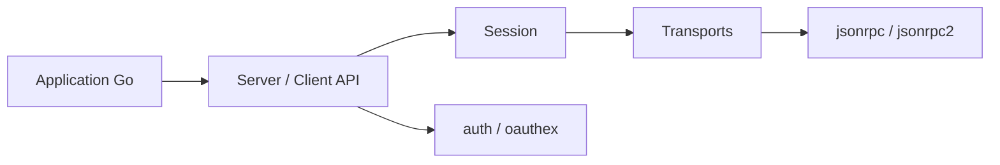

# modelcontextprotocol/go-sdk

> SDK Go officiel du Model Context Protocol pour écrire des serveurs et clients MCP.

## Le problème
Exposer des outils à un LLM ou en consommer, en Go, sans réimplémenter le protocole MCP.

## Ce que ça fait vraiment
Le paquet `mcp` fournit `Server`, `Client`, sessions, outils, ressources, prompts et transports (stdio, commande, SSE, HTTP streamable). `jsonrpc` sert aux transports personnalisés ; `auth` et `oauthex` gèrent OAuth et extensions MCP. Des tests de conformité couvrent plusieurs versions de la spécification, dont 2026-07-28 depuis v1.7.0.

## Comment c'est branché

## Essayer
Le README ne donne pas de commande d'installation. Il montre un exemple Go : `mcp.NewServer(...)`, `mcp.AddTool(...)`, puis `server.Run(ctx, &mcp.StdioTransport{})`.

## Coût et pièges
Licence présente mais non identifiée par GitHub. Roots, sampling et logging sont dépréciés depuis la spec 2026-07-28. OAuth côté client reste expérimental sur certaines versions.

## Ce que ce n'est pas
Pas un serveur MCP prêt à l'emploi : c'est une bibliothèque. Ce n'est pas le SDK Python.

## Alternatives
Le README ne nomme aucune alternative.

## Pour toi
À surveiller : à retenir si tu écris des outils MCP en Go ; sinon un SDK d'un autre langage suffit.
