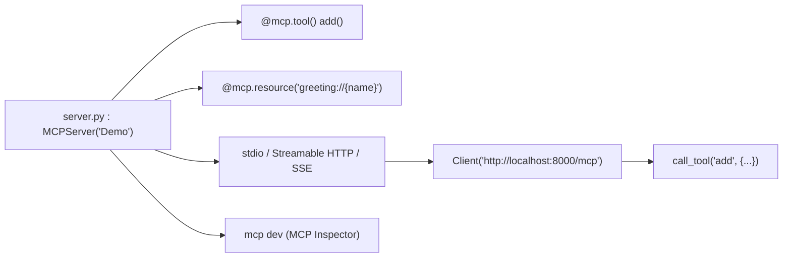

# modelcontextprotocol/python-sdk

> Le SDK Python officiel du Model Context Protocol, côté serveur comme côté client.

## Le problème
Exposer des outils à un LLM revient vite à écrire du JSON Schema à la main, du parsing de requêtes,
de la validation et de la plomberie de transport — du code qui n'est pas le sujet.

## Ce que ça fait vraiment
Un décorateur `@mcp.tool()` transforme une fonction annotée en outil : les annotations de type
*sont* le schéma, la docstring est la description. `@mcp.resource("greeting://{name}")` expose une
ressource paramétrée. Le même paquet fournit le client (`Client`), qui parle stdio, Streamable HTTP
et SSE. La CLI `mcp` (extra `cli`) apporte `mcp dev`, `mcp run` et `mcp install`.

## Comment c'est branché


## Essayer
```bash
uv add "mcp[cli]"
uv run mcp dev server.py
uv run mcp run server.py --transport streamable-http
```

## Coût et pièges
Python 3.10+. Le piège est le versionnage : `pip install mcp` installe désormais la 2.x, une refonte
majeure. Le README demande explicitement d'épingler `>=1.28,<2` tant que la migration n'est pas faite.
La 1.x survit sur la branche `v1.x` avec seulement correctifs critiques et de sécurité.

## Ce que ce n'est pas
Pas un hôte MCP : il produit des serveurs et des clients, pas l'application qui les orchestre.
Pas un déploiement : le README montre `localhost`, la mise en production reste à ta charge.
Pas stable au sens API : la v2 casse, et le guide de migration existe pour cette raison.

## Alternatives
- La branche `v1.x` du même dépôt, si une migration est hors budget.

## Pour toi
Le socle à connaître pour exposer tes propres outils à un agent — commence par épingler la version.
