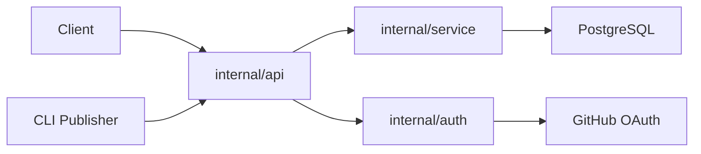

# modelcontextprotocol/registry

> Registre officiel des serveurs MCP : un « app store » interrogeable par API.

## Le problème
Les clients MCP n'ont pas de source unique et fiable pour découvrir les serveurs MCP.

## Ce que ça fait vraiment
Une API Go (routeurs, services, PostgreSQL) qui liste et publie des serveurs MCP.
La CLI `mcp-publisher` publie un `server.json`.
Propriété du namespace vérifiée par GitHub OAuth ou OIDC, DNS ou HTTP.
API gelée en v0.1 ; en prévisualisation, des réinitialisations restent possibles.

## Comment c'est branché


## Essayer
```bash
make dev-compose
make publisher
./bin/mcp-publisher --help
```

## Coût et pièges
Gratuit ; il faut Docker, Go et ko pour développer. L'image Docker n'embarque pas PostgreSQL.

## Ce que ce n'est pas
Pas encore GA : des changements cassants restent possibles. Ce n'est pas lui-même un serveur MCP.

## Alternatives
Aucune alternative nommée dans le README.

## Pour toi
À surveiller : utile pour publier ou découvrir des serveurs MCP ; pas besoin de l'héberger, l'API publique suffit.
