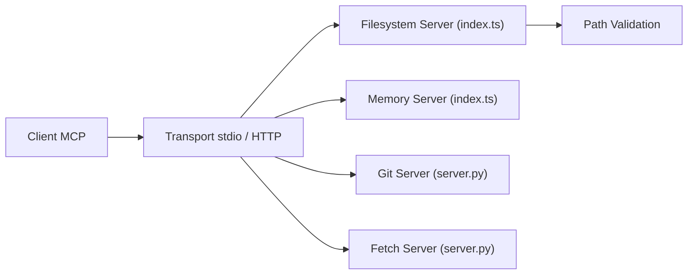

# modelcontextprotocol/servers

> Serveurs de référence pour le Model Context Protocol, servant d'exemples aux développeurs de serveurs MCP.

## Le problème
Un modèle de langage n'accède pas de lui-même à des fichiers, à Git ou au web ; il faut un protocole commun et des exemples pour brancher des outils de façon contrôlée.

## Ce que ça fait vraiment
Sept serveurs de référence : Everything (test), Fetch (web vers texte), Filesystem (accès contrôlé), Git, Memory (graphe de connaissances), Sequential Thinking et Time. Un client MCP lance le serveur via stdio ou HTTP ; le serveur valide la requête et renvoie du contenu MCP. Les serveurs TypeScript se lancent via `npx`, les serveurs Python via `uvx` ou `pip`. Les anciens serveurs (GitHub, PostgreSQL, Slack…) sont archivés ailleurs.

## Comment c'est branché


## Essayer
```bash
npx -y @modelcontextprotocol/server-memory
uvx mcp-server-git
pip install mcp-server-git
python -m mcp_server_git
```
Puis ajouter le serveur au fichier de configuration du client (bloc `mcpServers` du README).

## Coût et pièges
Gratuit. Le README avertit : ce sont des implémentations de référence, pas des solutions prêtes pour la production ; chacun évalue sa sécurité. Ses exemples de configuration citent encore `server-github` et `server-postgres`, listés comme archivés. Licence présente mais non identifiée par GitHub.

## Ce que ce n'est pas
Ni un annuaire de serveurs MCP (renvoi au MCP Registry), ni une garantie de sécurité. Le serveur Filesystem donne un accès réel à tes fichiers dans les chemins autorisés.

## Alternatives
- MCP Registry : pour parcourir les serveurs publiés.
- servers-archived : pour retrouver GitHub, PostgreSQL, Slack et d'autres serveurs archivés.

## Pour toi
À adopter comme base d'apprentissage MCP : le code court montre comment outiller un agent, à condition de traiter ces serveurs comme des exemples.

