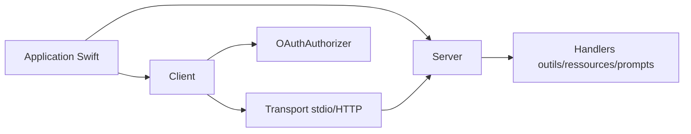

# modelcontextprotocol/swift-sdk

> SDK Swift officiel du protocole MCP, côté client et côté serveur, pour développeurs Apple et Linux.

## Le problème
Brancher une appli Swift sur des serveurs MCP, ou exposer un serveur MCP en Swift, demande d'implémenter le protocole à la main.

## Ce que ça fait vraiment
Bibliothèque Swift 6 conforme à la spécification MCP 2025-11-25 : client et serveur, transports stdio, HTTP client, HTTP serveur avec ou sans état, mémoire et réseau, outils, ressources, prompts, complétions, sampling, roots, journalisation, progression, annulation, lots. L'authentification OAuth 2.1 (PKCE, métadonnées de ressource protégée) est optionnelle.

## Comment c'est branché


## Essayer
```swift
dependencies: [
    .package(url: "https://github.com/modelcontextprotocol/swift-sdk.git", from: "0.11.0")
]
```

## Coût et pièges
Gratuit. Swift 6 / Xcode 16 requis ; le README précise des versions minimales par plateforme. La version 0.11 : l'API peut encore bouger.

## Ce que ce n'est pas
Pas un serveur prêt à lancer : il faut écrire ses propres handlers. Le stockage des jetons est en mémoire par défaut. Licence présente mais non identifiée par GitHub.

## Alternatives
Aucune alternative nommée dans le README.

## Pour toi
À ignorer : utile seulement si tu développes en Swift ; pour un profil data/IA en Python, un SDK d'un autre langage sert mieux.
