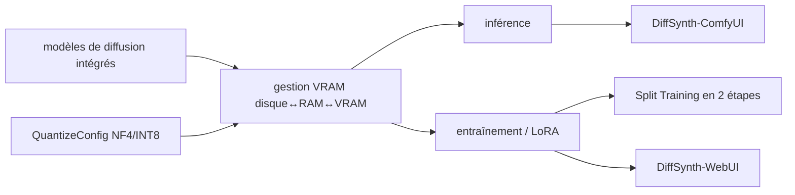

# modelscope/DiffSynth-Studio

> Moteur open source de modèles de diffusion : inférence et entraînement image, vidéo, audio.

## Le problème
Chaque nouveau modèle de diffusion arrive avec son propre code d'inférence, et les gros modèles ne
tiennent pas dans la VRAM d'un GPU grand public.

## Ce que ça fait vraiment
Le framework intègre les principaux modèles de diffusion ouverts — génération d'image, de vidéo,
d'audio, et modèles de métriques de qualité d'image (FID, CLIP, Aesthetic, PickScore, ImageReward,
HPSv2, HPSv3). Sa gestion de VRAM déplace dynamiquement les paramètres entre disque, mémoire et
VRAM, avec offload au niveau de la couche. La quantification (`QuantizeConfig`, backends
bitsandbytes, torchao, comfy-kitchen) descend en NF4 et INT8, y compris pour l'entraînement LoRA.
Presque tout modèle inférable est aussi entraînable — modèle de base, LoRA ou adaptateur — et le
« Split Training » sépare traitement des données et entraînement via un moteur de graphe de calcul.

## Comment c'est branché

## Essayer
Aucune commande d'installation ou d'exécution n'est présente dans la partie lisible du README : il
renvoie à la documentation développeur (versions chinoise et anglaise) et aux dossiers d'exemples
par modèle, par exemple `./examples/diffsynth_music/`.

## Coût et pièges
Gratuit, mais c'est un GPU qui paie : la quantification et l'offload CPU
(`--enable_model_cpu_offload`, mono-GPU seulement) servent précisément à tenir sur du matériel grand
public. Le README avertit que le projet a connu une refonte majeure et que certaines anciennes
fonctionnalités ne sont plus maintenues — il faut basculer sur une version historique pour les
retrouver.

## Ce que ce n'est pas
Ce n'est pas un moteur de déploiement stable : les auteurs orientent vers DiffSynth-Engine pour la
mise en production industrielle. Ce n'est pas non plus un projet à grande équipe — ils préviennent
que le développement repose sur peu de personnes, que les nouvelles fonctions arrivent lentement et
que la réponse aux issues est limitée. SD v1.5 et SDXL ne sont soutenus que pour la recherche.

## Alternatives
- DiffSynth-Engine : même famille, orienté déploiement stable et performance industrielle.
- DiffSynth-ComfyUI : pour construire des workflows dans ComfyUI plutôt qu'en Python.
- DiffSynth-WebUI : outil léger d'entraînement LoRA sur GPU grand public.

## Pour toi
À surveiller si tu fais de la génération d'images : l'offload par couche et la quantification sont
ce qui rend un modèle 20B utilisable sur une carte de bureau.
