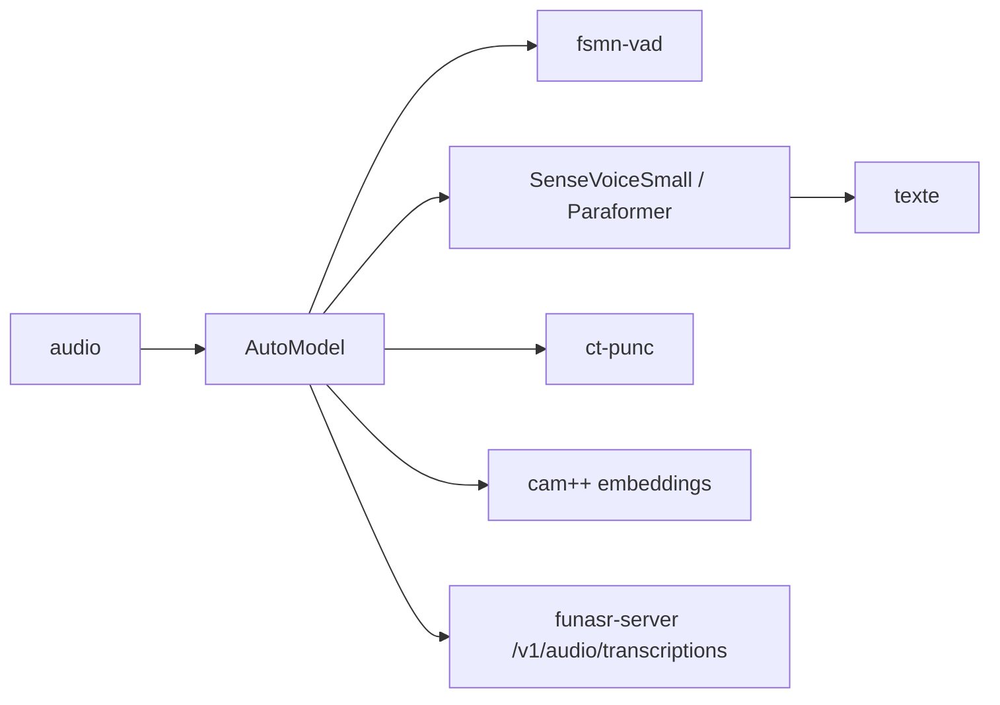

# modelscope/FunASR

> Boîte à outils de reconnaissance vocale industrielle : transcription, VAD, ponctuation, locuteurs, émotions.

## Le problème
Transcrire de l'audio chinois ou multilingue avec Whisper donne des taux d'erreur décevants sur le chinois.
Et assembler soi-même VAD, ponctuation et segmentation par locuteur revient à recoder un pipeline entier.

## Ce que ça fait vraiment
Assemble tâche, checkpoint et runtime séparément : `AutoModel` compose ASR, VAD, ponctuation, locuteurs.
Fournit une CLI (`funasr audio.wav`, sorties JSON ou SRT) et un serveur compatible API OpenAI.
Propose un chemin CPU/edge en llama.cpp/GGUF, binaire autonome, sans Python à l'exécution.
Le zoo de modèles va de SenseVoiceSmall (234M, zh/en/ja/ko/yue + émotions) à Fun-ASR-Nano (800M).

## Comment c'est branché


## Essayer
```bash
pip install torch torchaudio
pip install funasr
funasr audio.wav --output-format srt --output-dir ./subs
```
Service local CPU : `funasr-server --host 127.0.0.1 --port 8000 --model sensevoice --device cpu`.

## Coût et pièges
Le service HTTP est sans authentification : le README demande de le garder sur la boucle locale.
`device="cuda"` seulement après avoir vérifié que `torch.cuda.is_available()` renvoie `True`.

## Ce que ce n'est pas
Les indices de locuteur sont anonymes et locaux à un enregistrement : ce n'est pas de l'identification de personnes.
La couverture linguistique dépend du checkpoint : Nano (zh/en/ja) et MLT-Nano (31 langues) sont deux choix distincts.
Les licences des modèles sont séparées de la licence MIT de la boîte à outils.

## Alternatives
`Whisper-large-v3` / `-turbo` — multilingue avec traduction, listés dans le zoo comme option.
`Qwen3-ASR` (52 langues) ou `GLM-ASR-Nano` (17 langues) — si la couverture prime sur le chinois.
`MOSS-Transcribe-Diarize` (OpenMOSS) — pour texte, horodatage et locuteurs dans un seul passage hors ligne.

## Pour toi
Le meilleur choix si tu transcris du chinois ou si tu veux un binaire CPU sans Python en production.
