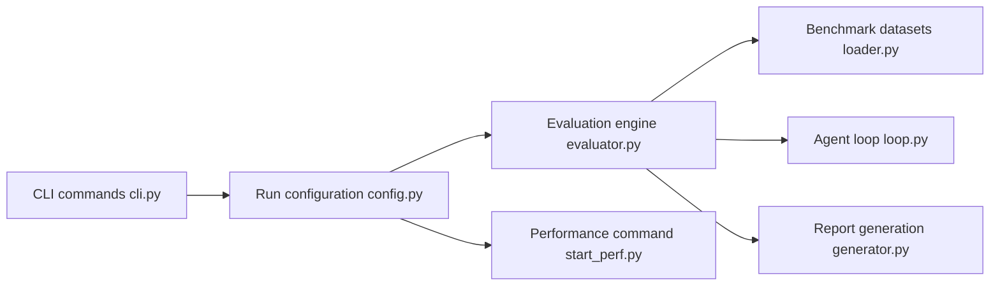

# modelscope/evalscope

> Framework d'évaluation de LLM, VLM et services d'inférence, avec benchmarks, stress tests et tableau de bord.

## Le problème
Comparer des modèles demande de brancher chaque benchmark, mesurer latence et débit des services, et agréger les résultats.

## Ce que ça fait vraiment
`evalscope eval` lance des benchmarks (MMLU, C-Eval, GSM8K, SWE-bench, etc.) sur un modèle via API OpenAI/Anthropic ou local. Un mode agent pilote les benchmarks dans une boucle multi-tours avec outils et sandbox Docker ; un pont pilote Claude Code ou Codex. Un module de perf mesure TTFT, TPOT et débit. Mode Arena par duels, backends OpenCompass, VLMEvalKit, RAGEval, tableau de bord web.

## Comment c'est branché


## Essayer
```bash
pip install evalscope
evalscope eval --model your-model-name --api-url $OPENAI_API_BASE_URL --api-key $OPENAI_API_KEY --eval-type openai_api --datasets gsm8k --limit 5
pip install 'evalscope[service]'
evalscope service
```

## Coût et pièges
Évaluer une API consomme des tokens facturés ; un modèle local télécharge ses poids. Penser à `--limit` pour tester. Pas de GPU requis en mode API.

## Ce que ce n'est pas
Pas un leaderboard hébergé ni une garantie de qualité : les scores dépendent de la config. Beaucoup de benchmarks agent exigent Docker.

## Alternatives
- OpenCompass : orienté évaluation texte.
- VLMEvalKit : évaluation multimodale.
- RAGEval : évaluation RAG.

## Pour toi
À adopter : un seul outil pour comparer tes modèles et mesurer tes endpoints d'inférence, activement maintenu (v1.11.0, août 2026).

