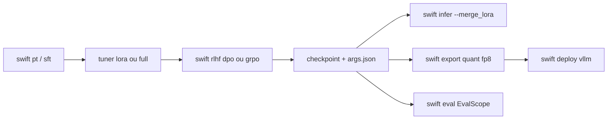

# modelscope/ms-swift

> Chaîne complète d'entraînement, d'alignement, d'évaluation et de déploiement de LLM et VLM.

## Le problème
Enchaîner fine-tuning, alignement, quantification, évaluation et service suppose
sinon d'assembler cinq bibliothèques aux conventions incompatibles.

## Ce que ça fait vraiment
Supporte 600+ modèles texte et 400+ multimodaux, 150+ datasets intégrés. Méthodes
légères : LoRA, QLoRA, DoRA, LoRA+, LLaMAPro, LongLoRA, LoRA-GA, ReFT, RS-LoRA,
Adapter, LISA. Entraînement sur modèles quantifiés BNB, AWQ, GPTQ, AQLM, HQQ, EETQ —
9 Go suffisent pour un 7B. Mémoire : GaLore, Q-GaLore, UnSloth, Liger-Kernel,
Flash-Attention 2/3, parallélisme de séquence Ulysses et Ring-Attention. Distribué :
DDP, DeepSpeed ZeRO2/ZeRO3, FSDP/FSDP2, et Megatron avec TP/PP/SP/CP/ETP/EP/VPP pour
les MoE. Alignement : DPO, GKD, KTO, RM, CPO, SimPO, ORPO, PPO, et la famille GRPO
(GRPO, DAPO, GSPO, SAPO, CISPO, CHORD, RLOO, Reinforce++). Tâches Embedding,
Reranker et classification de séquence. Inférence accélérée vLLM, SGLang, LMDeploy,
évaluation via EvalScope, quantification à l'export AWQ/GPTQ/FP8/BNB, Web-UI Gradio.

## Comment c'est branché


## Essayer
```bash
pip install ms-swift -U
CUDA_VISIBLE_DEVICES=0 swift sft --model Qwen/Qwen3-4B-Instruct-2507 --tuner_type lora --dataset 'AI-ModelScope/alpaca-gpt4-data-zh#500' --output_dir output
CUDA_VISIBLE_DEVICES=0 swift infer --adapters output/vx-xxx/checkpoint-xxx --stream true
SWIFT_UI_LANG=en swift web-ui
```

## Coût et pièges
Gratuit, mais c'est du GPU : l'exemple de démarrage annonce 13 Go sur une 3090 pour
un 4B en LoRA. Matrice de dépendances stricte (torch ≥2.0, transformers ≥4.33,
datasets <4.8.5, peft <0.21, trl <1.0). Par défaut modèles et datasets viennent de
ModelScope, pas de Hugging Face : `--use_hf true` inverse. La branche `main` est
swift 4.x ; pour 3.x il faut `git checkout release/3.12`.

## Ce que ce n'est pas
Pas un service géré ni une API : un cadre en ligne de commande, très paramétré. La
surface est énorme, donc la documentation renvoyée est aussi énorme — ce n'est pas
un outil qu'on prend en main en une heure.

## Alternatives
- Megatron-SWIFT : le même dépôt en mode Megatron, pour les grands clusters et MoE.
- EvalScope : le backend d'évaluation, utilisable seul.

## Pour toi
Le couteau suisse à garder sous la main pour un fine-tuning sérieux, surtout si les
modèles viennent de ModelScope.
