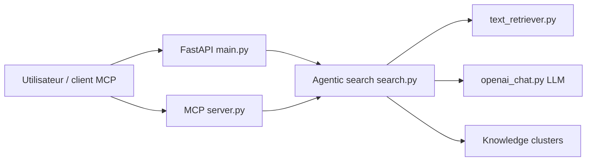

# modelscope/sirchmunk

> Moteur de recherche agentique sans base vectorielle sur des fichiers bruts, avec clusters de connaissance réutilisables.

## Le problème
Un RAG classique impose d'indexer et de réindexer les documents ; les embeddings deviennent périmés dès que les fichiers changent.

## Ce que ça fait vraiment
Recherche directement dans les fichiers avec ripgrep(-all), puis un LLM juge des zones candidates sous un budget de tokens (modes DEEP, FAST, FILENAME_ONLY). Chaque réponse produit un KnowledgeCluster persisté (DuckDB/Parquet) et réutilisé par similarité. Exposé via SDK Python, CLI, API FastAPI/SSE, serveur MCP et interface web. Une étape `compile` en bêta préconstruit des index.

## Comment c'est branché


## Essayer
```bash
pip install sirchmunk
sirchmunk init
sirchmunk search "How does authentication work?" ./src ./docs
sirchmunk search "config" --mode FILENAME_ONLY
sirchmunk web serve
```

## Coût et pièges
Clé d'API LLM compatible OpenAI à ta charge (hors mode FILENAME_ONLY). DEEP : 10 à 30 s par requête. Installation automatique de ripgrep-all au démarrage.

## Ce que ce n'est pas
Pas un remplaçant prouvé du RAG vectoriel : les gains annoncés viennent du README et d'un article. Version 0.0.x.

## Alternatives
Aucune alternative nommée ; le README se compare au RAG vectoriel classique.

## Pour toi
À surveiller : approche intéressante pour chercher dans des corpus changeants sans index, mais très jeune (0.0.7) et coûteuse en appels LLM.

