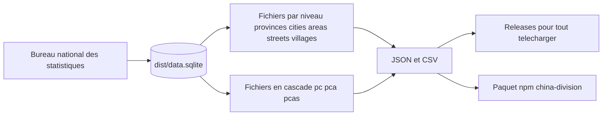

# modood/Administrative-divisions-of-China

> **Le découpage administratif chinois à cinq niveaux, en JSON, CSV et SQLite, prêt à charger.**

## Le problème

Les codes de division administrative chinois (province, ville, district, canton, village) sont
publiés par le Bureau national des statistiques sous une forme difficile à exploiter, et le
README signale qu'à partir d'octobre 2024 les codes détaillés ne sont plus publiés au public.
Sans un jeu de données déjà consolidé, il faut aller les récupérer soi-même à la source.

## Ce que ça fait vraiment

Le dépôt distribue les cinq niveaux du découpage administratif de la République populaire de
Chine sous forme de fichiers téléchargeables : `provinces`, `cities`, `areas`, `streets`,
`villages`, chacun en JSON et en CSV. Il fournit aussi des fichiers de listes liées prêts pour
des sélecteurs en cascade : `pc` (province/ville), `pca` (+ district), `pcas` (+ canton), avec
une variante « avec code » (`pc-code`, `pca-code`, `pcas-code`). Le README précise qu'il n'y a
pas de fichier de cascade à cinq niveaux. Chaque enregistrement porte un `code`, un `name` et
les codes des niveaux parents (`provinceCode`, `cityCode`, `areaCode`, `streetCode`), ce que
les tableaux d'aperçu du README montrent explicitement. Les données sont conservées dans un
SQLite (`dist/data.sqlite`) que le README invite à migrer vers MySQL, Oracle ou MSSQL.

## Comment c'est branché



Le README décrit une chaîne à sens unique : la source officielle alimente une base SQLite,
d'où sont dérivés les fichiers par niveau et les fichiers de cascade, publiés en JSON et en
CSV dans `dist/`. Le README renvoie aux Releases pour un téléchargement groupé et affiche un
badge npm pour le paquet `china-division`. Il ne documente pas le code qui produit ces
fichiers.

## Essayer

```
# Aucune commande d'installation ou de génération n'est documentée dans le README.
# Il renvoie vers les fichiers de dist/ et vers la page Releases pour un téléchargement groupé.
```

Le README se limite à des liens de téléchargement : on récupère le fichier du niveau voulu, ou
`data.sqlite`, et on le charge soi-même. Un badge signale un paquet npm `china-division`, mais
aucune ligne d'installation n'est écrite — rien n'est reconstruit ici.

## Coût et pièges

Rien à payer, aucune clé d'API, aucun service tiers : ce sont des fichiers statiques. Le piège
est ailleurs et il est explicite dans le README : **les données ne sont plus mises à jour**,
l'arrêt est annoncé en tête de la section « sources ». La dernière version correspond aux codes
de 2023 (arrêtés au 30/06/2023, publiés le 11/09/2023). Le README rappelle aussi que depuis
octobre 2024 le Bureau national des statistiques ne publie plus les codes détaillés, donc
rafraîchir soi-même n'est pas trivial. Le niveau village est volumineux par nature, ce que le
README ne chiffre pas.

## Ce que ce n'est pas

Ce n'est pas une API ni un service interrogeable : aucun serveur, aucune requête, seulement des
fichiers à télécharger. Ce n'est pas non plus une source vivante — le dépôt est gelé sur l'état
2023 et ne suivra pas les fusions, créations ou renommages de divisions postérieurs. Ce n'est
pas un géocodeur : il n'y a ni coordonnées, ni frontières, ni polygones dans ce que le README
décrit, uniquement des codes, des noms et des liens de parenté.

## Alternatives

Aucune alternative comparable dans le catalogue : les voisins proposés (`Asabeneh/30-Days-Of-JavaScript`,
un cursus d'apprentissage JavaScript, et `pinojs/pino`, un logger Node) n'ont aucun rapport avec
un jeu de données de découpage administratif. Le README ne cite aucun projet concurrent, seulement
la source officielle du Bureau national des statistiques.

## Pour toi

Utile si tu fais de la donnée géographique ou de l'analyse sur la Chine : c'est un référentiel
de codes propre, hiérarchisé, à joindre directement à tes tables. À traiter comme un instantané
daté de 2023, pas comme une source à jour — vérifie la fraîcheur avant de t'appuyer dessus en
production.
