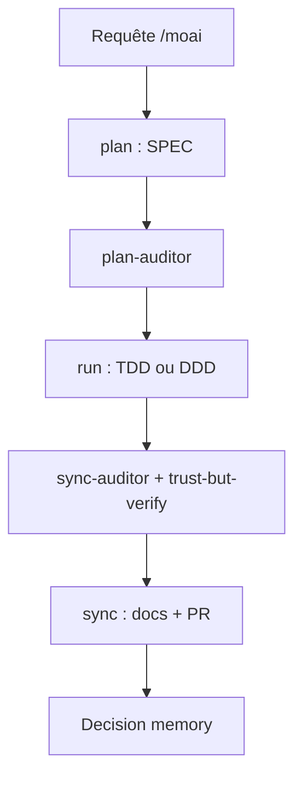

# modu-ai/moai-adk

> Harnais autour de Claude Code qui impose plan, exécution et synchronisation avec preuves de vérification.

## Le problème
Un agent de code affirme « les tests passent » sans preuve, perd le fil après `/clear` et brûle des tokens en boucles de retry.

## Ce que ça fait vraiment
Binaire Go qui enveloppe Claude Code : cycle SPEC plan → run → sync, audits indépendants, rapports de preuve obligatoires, `/moai goal` avec limites (tours, stagnation, durée), worktrees par SPEC, mode Kanban à quatre terminaux, mode CG (Claude + GLM z.ai). 12 agents, 16 langages, console web locale. Les chiffres de coût viennent de l'auteur.

## Comment c'est branché


## Essayer
```bash
curl -fsSL https://adk.mo.ai.kr/install.sh | bash
moai init my-project
cd my-project
claude
```
Puis `/moai plan "Add JWT login"`, `/moai run SPEC-AUTH-001`, `/moai sync SPEC-AUTH-001`.

## Coût et pièges
Abonnement ou API Claude à ta charge ; GLM (z.ai, dès 10 $/mois) en option. Kanban demande de lancer les sessions à la main. Windows : WSL recommandé. Installation par `curl | bash`.

## Ce que ce n'est pas
Pas un remplaçant de Claude Code : une couche de process par-dessus. Le schéma d'architecture fourni décrit une ancienne version Python, le README actuel parle d'un binaire Go.

## Alternatives
Le README compare seulement à Claude Code seul et aux « harnais typiques », sans les nommer.

## Pour toi
À surveiller : les garde-fous de vérification sont intéressants si tu délègues beaucoup de code à un agent, mais le cadre est lourd et très opinionné.
