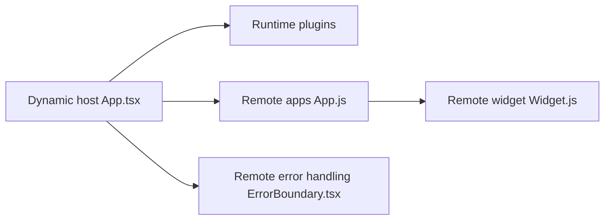

# module-federation/module-federation-examples

> Dépôt d'exemples montrant Module Federation de Webpack 5 pour partager du code entre applications front.

## Le problème
Comprendre comment charger à l'exécution des modules d'autres builds (micro-frontends).

## Ce que ça fait vraiment
Réunit de nombreux exemples : remotes dynamiques, imports synchrones, composants partagés, routage, SSR (Angular, Apollo), Svelte. Le README renvoie vers la liste complète et la doc. Le dépôt contient aussi des liens commerciaux (livre, consultations, Zephyr Cloud).

## Comment c'est branché


## Essayer
```bash
pnpm i
pnpm start
```
À lancer depuis la racine puis depuis un exemple non propriétaire (certains utilisent `dev` ou `serve`).

## Coût et pièges
Gratuit ; pnpm et workspaces requis. Il faut supprimer les dossiers d'exemples « proprietary » avant d'installer depuis un checkout git.

## Ce que ce n'est pas
Ce n'est pas une bibliothèque : ce sont des démos de front-end sans API stable.

## Alternatives
Aucune alternative nommée dans le README.

## Pour toi
À ignorer : sujet purement front-end, sans rapport avec la data ou le MLOps.

