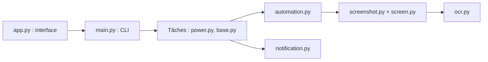

# moesnow/March7thAssistant

> Assistant d'automatisation pour le jeu Honkai: Star Rail : tâches quotidiennes, hebdomadaires, notifications.

## Le problème
Les tâches répétitives du jeu (énergie, entraînement quotidien, récompenses) prennent du temps chaque jour.

## Ce que ça fait vraiment
Lance, via interface graphique ou CLI, des tâches quotidiennes et hebdomadaires en pilotant le jeu : capture d'écran, reconnaissance et OCR (RapidOCR), simulation de saisie. Supporte le jeu cloud (arrière-plan, Docker), l'export des tirages (UIGF/SRGF), des notifications et la fermeture automatique du jeu. Un module `telemetry.py` figure dans le code.

## Comment c'est branché


## Essayer
```bash
git clone --recurse-submodules https://github.com/moesnow/March7thAssistant
cd March7thAssistant
pip install -r requirements.txt
python app.py
python main.py
```
Ou télécharger la release et lancer `March7th Launcher.exe`.

## Coût et pièges
Gratuit. Windows de préférence, avec privilèges administrateur conseillés. Les automatisations de jeu peuvent contrevenir aux conditions du jeu (non documenté dans le README).

## Ce que ce n'est pas
Pas un outil de productivité générale : il ne sert que pour ce jeu. README principalement en chinois.

## Alternatives
- Auto_Simulated_Universe : cité comme projet dont il reprend des capacités.
- Fhoe-Rail : idem pour la tâche «锄大地 ».

## Pour toi
À ignorer : automatisation de jeu sans rapport avec data/IA, avec un module de télémétrie à vérifier.

