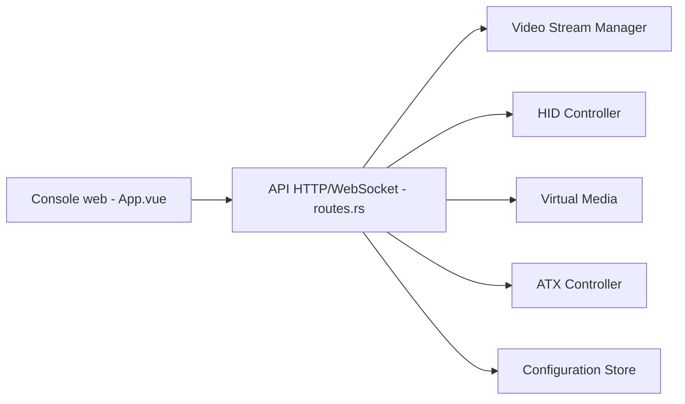

# mofeng-git/One-KVM

> Solution IP-KVM légère en Rust pour piloter à distance un serveur ou un poste, jusqu'au BIOS.

## Le problème
Dépanner une machine sans système démarré exige un accès physique à écran, clavier et alimentation.

## Ce que ça fait vraiment
Un binaire Rust avec interface web : capture vidéo (HDMI USB, MIPI CSI, RK3588), flux MJPEG ou WebRTC (H.264, H.265, VP8, VP9), encodage matériel ou logiciel, clavier et souris via USB OTG ou CH340/CH9329, média virtuel (ISO, Ventoy), contrôle d'alimentation ATX par GPIO ou relais USB, audio Opus. Le code décrit aussi une API Redfish et un module « computer use ». Le README est en chinois.

## Comment c'est branché


## Essayer
```bash
sudo apt update
sudo apt install ./one-kvm_0.x.x_<arch>.deb
docker run --name one-kvm -itd \
  --privileged=true --restart unless-stopped \
  -v /dev:/dev -v /sys:/sys \
  --net=host \
  silentwind0/one-kvm-full
```

## Coût et pièges
Matériel spécifique de capture et de contrôle à prévoir. Le conteneur tourne en mode privilégié avec `/dev` et `/sys` montés et le réseau hôte : à isoler. Documentation détaillée sur un site externe.

## Ce que ce n'est pas
Ce n'est pas un logiciel de bureau à distance : il agit au niveau matériel. La version Python est abandonnée, remplacée par la version Rust.

## Alternatives
Aucune alternative nommée dans le README ; l'ancienne version Python est citée comme abandonnée.

## Pour toi
À ignorer sauf si tu gères un parc de machines physiques (homelab, GPU) à dépanner à distance : hors périmètre data/IA.

