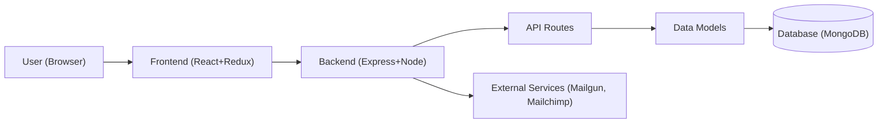

# mohamedsamara/mern-ecommerce

> Boutique en ligne MERN avec trois rôles (acheteur, marchand, admin), pour apprendre ou amorcer un projet web.

## Le problème
Monter une boutique complète (catalogue, panier, commandes, gestion marchands) from scratch prend des semaines, même avec une stack connue.

## Ce que ça fait vraiment
Un client React/Redux et un serveur Express/Mongoose (MongoDB). Trois parcours : l'acheteur parcourt catégories, produits, marques ; le marchand gère sa marque ; l'admin pilote tout. Des services d'e-mail (Mailchimp, Mailgun) et une couche socket sont présents d'après le code. Un script de seed crée l'admin.

## Comment c'est branché


## Essayer
```bash
git clone https://github.com/mohamedsamara/mern-ecommerce.git
# éditer docker-compose.yml : MONGO_URI et JWT_SECRET
docker-compose build
docker-compose up
npm run seed:db [email] [password]
npm run dev
```

## Coût et pièges
Gratuit, mais il faut une base MongoDB, des fichiers `.env` client et serveur, et des comptes tiers (Mailchimp/Mailgun) pour les e-mails. Dernier push en août 2024.

## Ce que ce n'est pas
Pas une plateforme e-commerce maintenue en continu : les paiements et la conformité ne sont pas détaillés dans le README. Une démo de référence, pas un produit.

## Alternatives
Aucune alternative nommée dans le README.

## Pour toi
À ignorer : c'est du web full-stack généraliste sans lien avec la donnée ou le MLOps, et il n'a pas bougé depuis plus d'un an.

