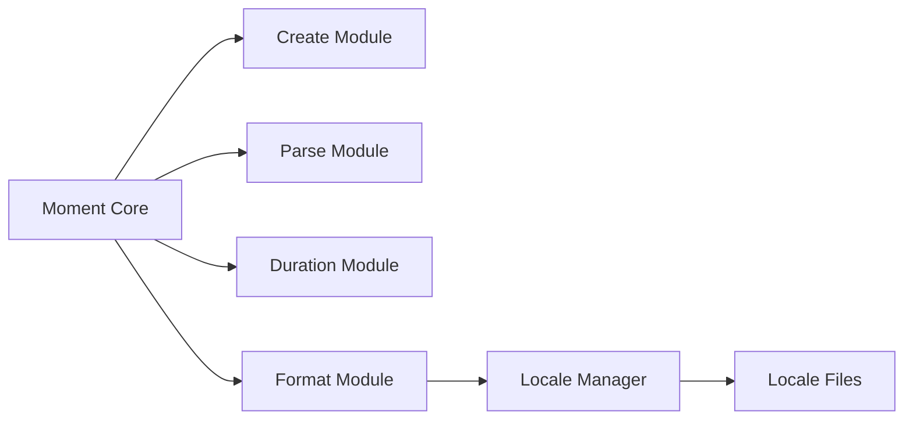

# moment/moment

> Bibliothèque JavaScript de dates, en mode maintenance, pour du code existant.

## Le problème
Analyser, valider, manipuler et formater des dates en JavaScript.

## Ce que ça fait vraiment
README minimal (moins de 800 caractères). Il indique un projet historique, en mode maintenance, sous l'OpenJS Foundation, sans nouvelles fonctionnalités. Le code couvre création/parsing, durées, formatage et locales.

## Comment c'est branché

Le texte d'architecture est un guide de dessin supposé.

## Essayer
```bash
npm install moment
```

## Coût et pièges
Gratuit. Projet hérité : le README renvoie à une note d'état, aucune nouvelle fonction acceptée.

## Ce que ce n'est pas
Ce n'est pas un choix pour un nouveau projet. Fiche minimale : le README ne détaille ni l'API ni les alternatives.

## Alternatives
Aucune alternative nommée dans le README.

## Pour toi
À ignorer pour du neuf : le projet est en maintenance et n'accepte plus de fonctions ; garde-le seulement pour du code déjà en place.

