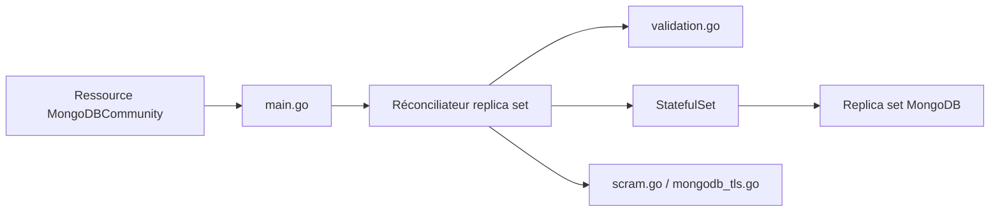

# mongodb/mongodb-kubernetes-operator

> Opérateur Kubernetes (édition communautaire) qui déploie des replica sets MongoDB ; dépôt déprécié.

## Le problème
Exploiter un replica set MongoDB sur Kubernetes (mises à jour, utilisateurs, TLS) demande beaucoup d'opérations manuelles.

## Ce que ça fait vraiment
Un utilisateur déclare une ressource `MongoDBCommunity` ; l'opérateur la réconcilie en StatefulSets et services, configure le replica set via l'agent MongoDB, et publie l'état. Gère changements de version, montée en charge, utilisateurs SCRAM, rôles personnalisés, X.509, TLS et métriques Prometheus.

## Comment c'est branché

## Essayer
Le README ne documente aucune commande : il renvoie à la documentation officielle pour l'installation.

## Coût et pièges
Gratuit, mais le support « au mieux » devait s'arrêter en novembre 2025. Le dépôt est archivé.

## Ce que ce n'est pas
Pas l'opérateur Enterprise (documentation distincte). Pas maintenu : le README indique de passer à `mongodb/mongodb-kubernetes`.

## Alternatives
- mongodb/mongodb-kubernetes : nouveau dépôt indiqué par MongoDB.

## Pour toi
À ignorer : archivé et déprécié ; pars directement sur le dépôt de remplacement.

