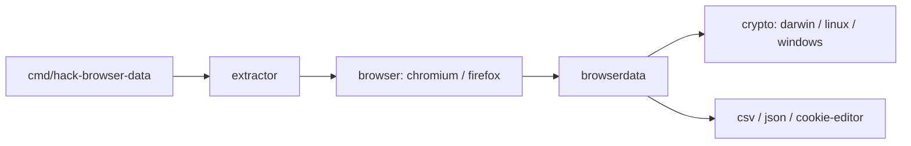

# moonD4rk/HackBrowserData

> Outil Go en ligne de commande qui déchiffre et exporte les données des navigateurs, pour analystes en recherche de sécurité.

## Le problème
Analyser un poste lors d'une investigation ou d'un audit suppose de lire des données de navigateur chiffrées, propres à chaque navigateur et système. L'outil unifie cette lecture.

## Ce que ça fait vraiment
- Lit et déchiffre mots de passe, cookies, historique, favoris, cartes, téléchargements, localStorage, sessionStorage et extensions.
- Couvre les navigateurs Chromium et Firefox sur Windows, macOS, Linux, et Safari sur macOS.
- Un mode « cross-host » sépare export des clés, archive des données et déchiffrement hors ligne sur un autre poste d'analyse.
- Sorties en CSV, JSON ou format Cookie-Editor.

## Comment c'est branché


## Essayer
```bash
hack-browser-data list
hack-browser-data version
```
À n'exécuter que sur une machine et des comptes dont tu as la maîtrise ou une autorisation écrite. Les commandes d'extraction sont décrites dans le README (`dump`, `dumpkeys`, `archive`, `restore`).

## Coût et pièges
Gratuit. Les antivirus le signalent comme malveillant, comme le README le reconnaît. Le fichier `keys.json` contient des clés en clair : c'est un secret. Le déchiffrement de cookies Chromium 127+ sous Windows demande une compilation avec Zig.

## Ce que ce n'est pas
Ce n'est pas un outil neutre : la même fonction sert l'analyse légitime et le vol d'identifiants. Le README le limite à la recherche en sécurité et décline toute responsabilité ; l'accès non autorisé aux données d'autrui est illégal.

## Alternatives
Aucune alternative nommée dans le README.

## Pour toi
Hors périmètre data/IA ; à surveiller seulement si tu fais de la réponse à incident ou de l'audit, avec cadre légal explicite.

