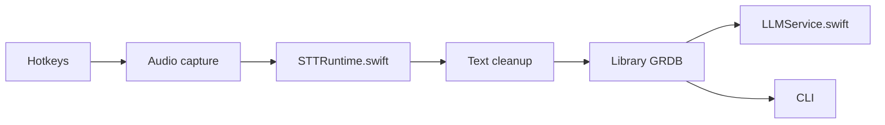

# moona3k/macparakeet

> Application macOS locale de dictée, transcription de fichiers et enregistrement de réunions sur Apple Silicon.

## Le problème
Les outils de transcription envoient l'audio dans le cloud ; la dictée système locale et rapide est rare.

## Ce que ça fait vraiment
Dictée globale par raccourci (collage du texte), transcription de fichiers, URL et podcasts (exports TXT, SRT, DOCX, PDF, JSON…), enregistrement de réunions micro + système avec calendrier. Moteurs locaux : Parakeet v3 par défaut, plus v2, Nemotron Beta, Cohere, WhisperKit. IA optionnelle (résumés, chat, Transforms) via le fournisseur de ton choix. CLI `macparakeet-cli` pour l'automatisation.

## Comment c'est branché


## Essayer
```bash
brew install --cask macparakeet
brew install moona3k/tap/macparakeet-cli
macparakeet-cli transcribe /path/to/audio.mp3
```

## Coût et pièges
Gratuit ; téléchargement de modèles (~465 Mo + ~130 Mo). Cohere exige 16 Go+ de RAM. Télémétrie activée par défaut (même en build source) ; le flux Discover appelle macparakeet.com au lancement.

## Ce que ce n'est pas
Pas multiplateforme : Apple Silicon, macOS 14.2+. Parakeet v3 échoue sur CJK/coréen. Licence non identifiée par GitHub.

## Alternatives
- WhisperKit et Cohere Transcribe : intégrés comme moteurs alternatifs.

## Pour toi
À surveiller : très complet pour la transcription locale sur Mac et bien benchmarké, mais vérifie la licence et coupe la télémétrie.

