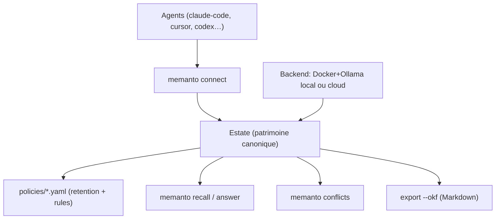

# moorcheh-ai/memanto

> Agent compagnon qui gère la mémoire des autres agents : quoi garder, quoi périmer, qui informer.

## Le problème
Toutes les plateformes stockent la mémoire des agents ; aucune ne te dit que deux d'entre eux
croient désormais l'inverse l'un de l'autre sur ton service d'auth.

## Ce que ça fait vraiment
Six comportements, chacun derrière une commande. Il observe les flux d'interaction et en
extrait le durable (`memanto remember --from-conversation`), consolide en un patrimoine
canonique (`memanto schedule enable`), réconcilie en remplaçant plutôt qu'en empilant
(`memanto conflicts`), oublie selon des politiques écrites en YAML (`memanto forget`), briefe
un agent avant qu'il agisse (`memanto agent bootstrap`), et exporte au format ouvert OKF —
du Markdown lisible, diffable, committable (`memanto memory export --okf`). 13 catégories de
mémoire typées. Rappel temporel avec `--as-of` et `--changed-since`.

## Comment c'est branché


## Essayer
```bash
pip install memanto
memanto                            # "On-Prem" (Docker, no account) or "Cloud" (free key)
memanto connect claude-code
memanto remember "Auth migrated to JWT — session cookies deprecated" --type decision
memanto recall "how does auth work"
memanto policy apply --dry-run
memanto ui
```

## Coût et pièges
MIT, deux backends : entièrement local (Docker + Ollama, rien ne sort de la machine) ou cloud
gratuit avec une clé et 100 000 opérations offertes sur console.moorcheh.ai. Le mode local
exige Docker. Le README contient encore un bloc TODO non rempli dans la section sécurité, et
la section démo signale un GIF manquant : le projet est jeune.

## Ce que ce n'est pas
Ce n'est pas un vector store ni un SDK de persistance : les substrats de stockage sont dessous,
Memanto est la couche de jugement au-dessus. Les benchmarks annoncés (89,8 % LongMemEval,
87,1 % LoCoMo) sont relativisés par les auteurs eux-mêmes : ils écrivent que les scores
inter-projets ne sont pas comparables et qu'il faut les lire comme directionnels.

## Alternatives
- Mem0, Letta, Supermemory : cités comme sources d'import via `memanto migrate`, donc
  concurrents directs côté stockage de mémoire.

## Pour toi
À suivre si tu fais tourner plusieurs agents qui doivent partager un même état de connaissance.
