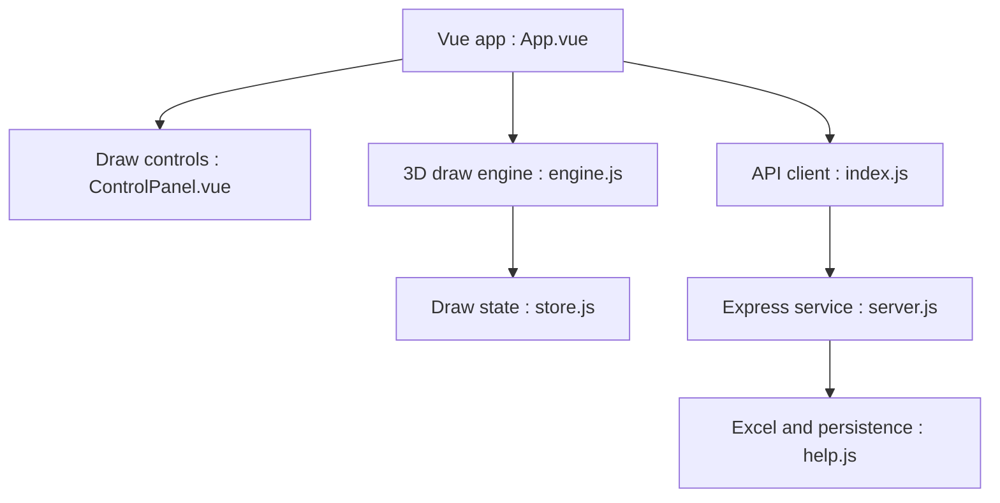

# moshang-ax/lottery

> Programme de tirage au sort pour dîner annuel, avec sphère 3D de noms, import et export Excel.

## Le problème
Animer un tirage au sort d'entreprise avec des lots configurables.

## Ce que ça fait vraiment
Front Vue 3 + Vite avec Three.js (CSS3D) pour la sphère de noms, et un serveur Node/Express qui lit la liste des participants dans `server/data/user.xlsx` et enregistre les gagnants. Les lots se configurent dans `server/config.js`. Les résultats s'exportent en Excel. Un déploiement Docker est décrit.

## Comment c'est branché


## Essayer
```bash
git clone https://github.com/moshang-xc/lottery.git
cd lottery/server && npm install
cd ../product && npm install
npm run build
npm run serve
```

## Coût et pièges
Gratuit. Le README Docker mentionne les ports 8888 et 443. L'URL de clone du README diffère du nom du dépôt catalogué.

## Ce que ce n'est pas
Pas un outil d'analyse ou d'IA : une application d'animation d'événement.

## Alternatives
Aucune alternative nommée dans le README.

## Pour toi
À ignorer : aucun usage data/IA/MLOps, sauf pour animer un événement d'équipe.

