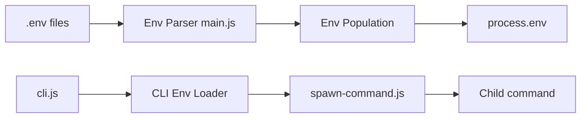

# motdotla/dotenv

> Charge les variables d'un fichier .env dans process.env, sans dépendance, pour apps Node.

## Le problème
Garder la configuration et les secrets hors du code (principe 12-factor) sans les exporter à la main à chaque lancement.

## Ce que ça fait vraiment
`config()` lit `.env`, l'analyse et remplit `process.env` sans écraser l'existant (sauf `override`). Options : chemin(s), encodage, debug, mode silencieux, parseur rapide, cible alternative. Nouveau CLI `dotenv run -- cmd` qui lance une commande avec le fichier chargé. Expansion de variables, chiffrement et multi-environnements sont renvoyés vers l'outil frère dotenvx.

## Comment c'est branché


## Essayer
```bash
npm install dotenv --save
npx dotenv run -- node index.js
dotenv run --file .env.local,.env node index.js
```

## Coût et pièges
Gratuit. Ne pas committer `.env` (sauf chiffré avec dotenvx). Depuis la v15, `#` démarre un commentaire sauf valeur entre guillemets.

## Ce que ce n'est pas
Pas un gestionnaire de secrets : le fichier reste en clair, et l'expansion de variables n'est pas incluse.

## Alternatives
dotenvx : expansion, chiffrement, multi-environnements.

## Pour toi
Réflexe standard pour tout service Node qui utilise des clés d'API (LLM, bases) ; en Python, l'équivalent n'est pas ce dépôt.

