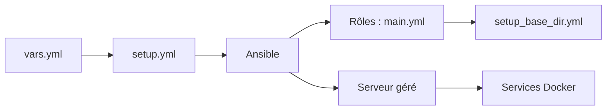

# mother-of-all-self-hosting/mash-playbook

> Playbook Ansible unique pour auto-héberger de nombreux services en conteneurs Docker sur son serveur.

## Le problème
Maintenir un playbook par service (Matrix, Nextcloud, Gitea…) duplique Postgres, Traefik, sauvegardes et documentation.

## Ce que ça fait vraiment
Un seul playbook réunit les services : on prépare `vars.yml`, on lance `setup.yml` et Ansible installe et met à jour les conteneurs, avec Postgres, reverse-proxy et sauvegardes partagés. Un utilitaire Python (`optimize.py`) filtre les entrées du playbook selon les variables configurées. Le playbook Matrix reste séparé.

## Comment c'est branché

## Essayer
Le README ne donne aucune commande : il renvoie au dossier `docs/` pour l'installation.

## Coût et pièges
Gratuit ; un serveur à toi et de l'expérience Ansible. Des changements incompatibles surviennent : lire le changelog avant chaque mise à jour.

## Ce que ce n'est pas
Pas une interface graphique ni un service managé. Pas un point de défaillance unique à éviter : le README conseille de répartir sur plusieurs serveurs.

## Alternatives
Aucune alternative nommée dans le README.

## Pour toi
À surveiller : utile pour monter un homelab ou un serveur d'équipe, mais peu lié aux métiers data/MLOps ; AGPL à noter pour toute redistribution.

