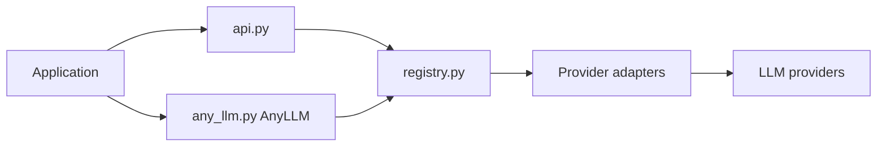

# mozilla-ai/any-llm

> SDK Python à interface unique vers de nombreux fournisseurs de LLM, sans proxy, pour développeurs d'applications.

## Le problème
Chaque fournisseur a ses variantes de paramètres et de réponses ; changer de modèle oblige à réécrire du code.

## Ce que ça fait vraiment
Une fonction `completion` (et `responses`, version async) avec `provider` et `model`, ou la classe `AnyLLM` qui réutilise le client. S'appuie sur les SDK officiels des fournisseurs, avec typage complet. Extras pip par fournisseur. Chemin de migration depuis LiteLLM : changer l'import et la chaîne `provider:model`. Passerelle optionnelle séparée (Otari).

## Comment c'est branché


## Essayer
```bash
pip install 'any-llm-sdk[mistral,ollama]'
export MISTRAL_API_KEY="YOUR_KEY_HERE"
```
```python
from any_llm import completion
response = completion(model="mistral-small-latest", provider="mistral",
                      messages=[{"role": "user", "content": "Hello!"}])
```

## Coût et pièges
Clés à ta charge chez chaque fournisseur. Python 3.11+.

## Ce que ce n'est pas
Pas une passerelle : pas de budget, de multi-tenant ni de proxy (renvoie vers mozilla-ai/otari). Pas un framework d'agents.

## Alternatives
LiteLLM : plus connu mais réimplémente les interfaces ; AISuite : sans maintenance active selon le README ; OpenRouter/Portkey : proxys hébergés.

## Pour toi
À adopter pour des scripts et services qui doivent changer de fournisseur sans réécriture : Apache-2.0, SDK officiels, éditeur actif.

