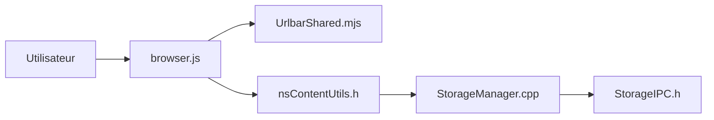

# mozilla-firefox/firefox

> Navigateur web de la fondation Mozilla ; ce dépôt en héberge le code source.

## Le problème
README de moins de 800 caractères : la fiche est minimale.

## Ce que ça fait vraiment
Navigateur de bureau et mobile. Le README renvoie vers les Firefox Source Docs et les builds Nightly. L'analyse du code mentionne des gestionnaires de stockage web, l'interface du navigateur, la barre d'URL et des services de plateforme (accessibilité, média).

## Comment c'est branché

Liens limités à ce que l'analyse a pu établir.

## Essayer
Aucune commande dans le README ; consulter les Firefox Source Docs.

## Coût et pièges
Gratuit. Compiler le navigateur est lourd (non documenté ici).

## Ce que ce n'est pas
Ce n'est pas un guide de démarrage : le README ne donne ni build ni licence lisible. La licence est « présente mais non identifiée par GitHub ».

## Alternatives
- Aucune alternative nommée dans le README.

## Pour toi
À ignorer pour la veille : pour utiliser Firefox, un installeur suffit ; ce dépôt ne concerne que ceux qui veulent contribuer au moteur.

