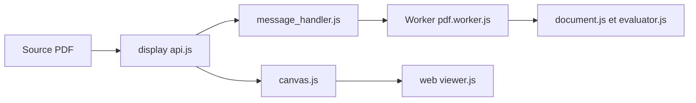

# mozilla/pdf.js

> Visionneuse et moteur de rendu PDF en JavaScript, intégré à Firefox, utilisable dans une page web.

## Le problème
Afficher un PDF dans un navigateur ou une application web sans greffon externe.

## Ce que ça fait vraiment
PDF.js sépare un moteur d'analyse (`src/core` : document, polices, images, XFA, interpréteur) exécuté dans un worker, une API d'affichage (`src/display`) qui rend en canvas avec couches de texte et d'annotations, et un visualiseur complet (`web/viewer.js`) avec recherche, impression, annotations, formulaires et éditeurs. Une extension Chromium, des exemples et une distribution npm (`pdfjs-dist`) sont fournis.

## Comment c'est branché


## Essayer
```bash
git clone https://github.com/mozilla/pdf.js.git
cd pdf.js
npm install
npx gulp server
npx gulp generic
```

## Coût et pièges
Gratuit sous Apache-2.0. Les fichiers PDF.js sont volumineux : à minifier en production. Un serveur local est nécessaire (pas de `file://`).

## Ce que ce n'est pas
Ce n'est pas un extracteur de contenu structuré pour l'IA : il rend les pages, il ne produit pas du texte organisé en tableaux.

## Alternatives
Aucune alternative nommée dans le README.

## Pour toi
Ignorer pour l'ingestion documentaire (préférer un outil d'extraction) ; à retenir seulement si tu construis un front qui affiche des PDF.

