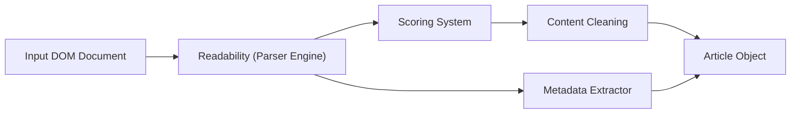

# mozilla/readability

> Bibliothèque JavaScript qui extrait le contenu d'un article web, celle du mode lecture de Firefox.

## Le problème
Les pages web mêlent article, publicités et navigation ; on veut n'en garder que le texte principal.

## Ce que ça fait vraiment
`new Readability(document).parse()` renvoie titre, contenu HTML, texte, extrait, auteur, langue, date. `isProbablyReaderable` évalue vite si une page s'y prête. Sous Node, il faut un DOM externe comme jsdom. Il ne nettoie pas le HTML : le README recommande DOMPurify et une CSP.

## Comment c'est branché


## Essayer
```bash
npm install @mozilla/readability
```
```js
var article = new Readability(document).parse();
```

## Coût et pièges
Gratuit. `parse()` modifie le DOM : passer un clone. Pour des entrées non fiables, assainir la sortie soi-même.

## Ce que ce n'est pas
Pas un assainisseur de HTML, et `isProbablyReaderable` peut se tromper dans les deux sens.

## Alternatives
Aucune alternative nommée dans le README.

## Pour toi
Adopter si tu construis un pipeline de collecte de pages pour RAG ou corpus : extraction d'article fiable, à combiner avec un assainisseur.

