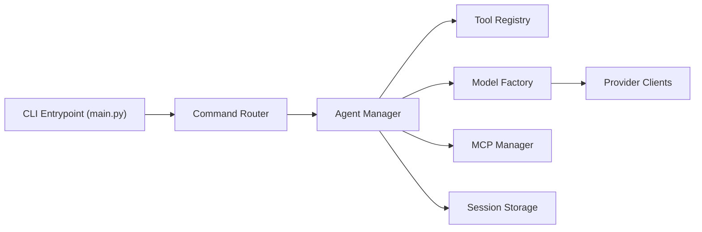

# mpfaffenberger/code_puppy

> Agent de code en terminal, multi-fournisseurs et personnalisable, pour qui veut éviter les IDE payants.

## Le problème
Les IDE assistés par IA restreignent l'accès aux modèles et augmentent leurs prix, selon l'auteur.

## Ce que ça fait vraiment
Agent CLI avec outils fichiers, grep et shell, agents Python ou JSON (`/agent`), règles `AGENTS.md`, commandes slash personnalisées, serveurs MCP, distribution round-robin de modèles et catalogue de plus de 65 fournisseurs via models.dev. Un plugin DBOS optionnel journalise les runs pour les reprendre. Sessions, undo et hooks sont présents dans le code.

## Comment c'est branché


## Essayer
```bash
uvx code-puppy -i
pip install "code-puppy[durable]"
/add_model
/agent agent-creator
```

## Coût et pièges
Python 3.11+ et une clé du fournisseur choisi (OpenAI, Anthropic, Gemini, Cerebras, Ollama…) à votre charge. Le README se contredit sur DBOS : « désactivé par défaut » d'un côté, « activé par défaut » de l'autre. 197 issues ouvertes.

## Ce que ce n'est pas
Pas un IDE. L'affirmation « zéro télémétrie » est une déclaration de l'auteur ; vos prompts partent chez le fournisseur de modèle sauf serveur local.

## Alternatives
- Windsurf et Cursor : IDE complets, mais c'est justement ce que l'auteur voulait éviter (prix, accès aux modèles).

## Pour toi
À surveiller : agent de code ouvert et multi-modèles, utile hors des IDE payants, mais tenu par une seule personne avec un tracker chargé.
