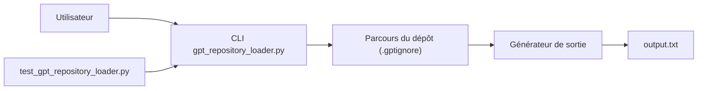

# mpoon/gpt-repository-loader

> Script Python qui exporte un dépôt Git en un seul fichier texte à donner à un LLM.

## Le problème
Donner à un modèle le contenu d'un dépôt entier demande de concaténer les fichiers en gardant l'arborescence.

## Ce que ça fait vraiment
`gpt_repository_loader.py` parcourt un dépôt, écrit le chemin et le contenu de chaque fichier dans `output.txt`, avec un préambule optionnel (`-p`) et un filtre `.gptignore`. Un test unitaire et des données d'exemple sont fournis.

## Comment c'est branché


## Essayer
```bash
python gpt_repository_loader.py /path/to/git/repository [-p /path/to/preamble.txt] [-o /path/to/output_file.txt]
python -m unittest test_gpt_repository_loader.py
```

## Coût et pièges
Gratuit. Dernier push le 2024-06-25, soit plus d'un an. Le fichier produit peut dépasser la fenêtre de contexte du modèle ; rien dans le README ne le gère, ni ne masque les secrets.

## Ce que ce n'est pas
Pas un outil de découpage ni de résumé : une concaténation brute, sans comptage de tokens.

## Alternatives
Non documenté dans le README.

## Pour toi
Ignorer : outil minimal et quasi abandonné ; un agent de code lit déjà l'arborescence, et rien n'y protège les secrets.
