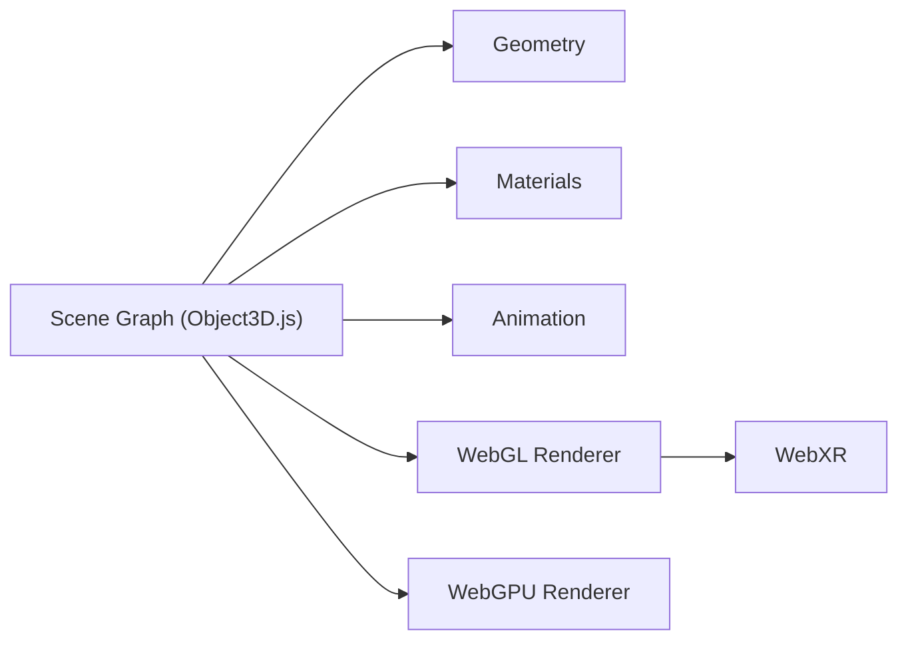

# mrdoob/three.js

> Bibliothèque JavaScript de rendu 3D dans le navigateur (WebGL, WebGPU), pour développeurs web.

## Le problème
Afficher une scène 3D dans un navigateur demande de manipuler directement WebGL, ce qui est long et bas niveau.

## Ce que ça fait vraiment
On construit une scène (caméra, objets, géométries, matériaux, animation) et un moteur de rendu la dessine. Les builds actuels incluent WebGL et WebGPU ; SVG et CSS3D sont en add-ons. Le graphe montre aussi le shading par nœuds (TSL) et le calcul, WebXR, les chargeurs d'assets, un éditeur de scène et un playground TSL.

## Comment c'est branché


## Essayer
```bash
git clone --depth=1 https://github.com/mrdoob/three.js.git
```
Le README donne aussi un exemple JavaScript de cube animé (`import * as THREE from 'three'`).

## Coût et pièges
Gratuit. Cloner l'historique complet coûte environ 2 Go ; le README recommande `--depth=1`. Le README ne donne pas la commande d'installation npm.

## Ce que ce n'est pas
Ni un moteur de jeu complet ni un outil de visualisation de données prêt à l'emploi : c'est une couche de rendu, à assembler.

## Alternatives
Aucune alternative nommée dans le README.

## Pour toi
À ignorer : utile seulement pour de la 3D navigateur ; un profil data/IA n'y trouve rien de son quotidien.

