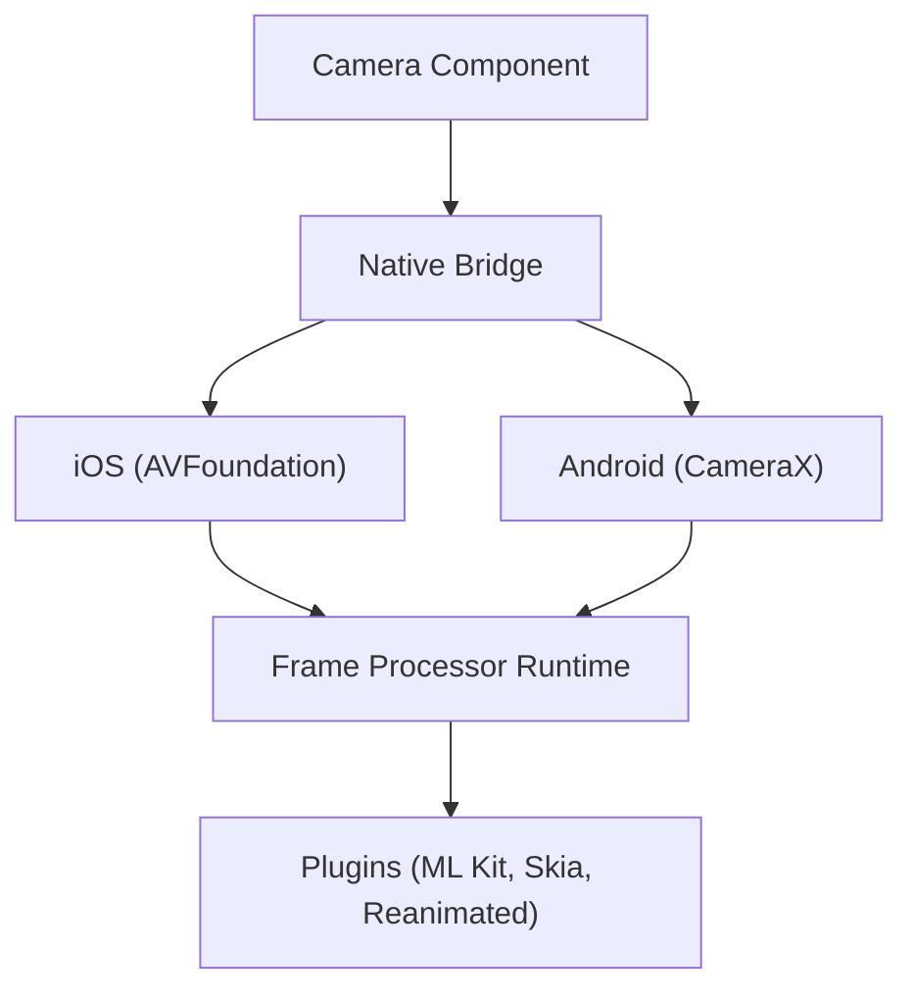

# mrousavy/react-native-vision-camera

> Bibliothèque caméra pour React Native : photo, vidéo, scan de codes et traitement d'images image par image.

## Le problème
Les modules caméra de React Native sont lents ou limités quand on veut traiter les images en direct, par exemple pour de la détection d'objets.

## Ce que ça fait vraiment
Composant `Camera` avec capture photo/vidéo, lecture de QR codes et codes-barres, choix d'appareil et de format, cadence 30 à 240 images/s, HDR. Les « Frame Processors » exécutent des worklets JavaScript sur chaque image (reconnaissance faciale, détection). Redimensionneur C++ accéléré par GPU (Metal/Vulkan). La version 4 n'est plus maintenue.

## Comment c'est branché


## Essayer
```bash
npm i react-native-vision-camera
cd ios && pod install
```
Puis afficher `<Camera style={StyleSheet.absoluteFill} device="back" isActive={true} />`.

## Coût et pièges
Gratuit. Demande de configurer les permissions caméra. Il faut passer à la version 5 : la 4 est archivée dans un dépôt à part.

## Ce que ce n'est pas
Ce n'est pas une bibliothèque de vision par ordinateur : elle fournit les images, l'analyse reste à brancher via des plugins.

## Alternatives
Aucune alternative nommée dans le README.

## Pour toi
À surveiller : utile si tu embarques un modèle de vision dans une application mobile React Native ; hors mobile, aucun intérêt.

