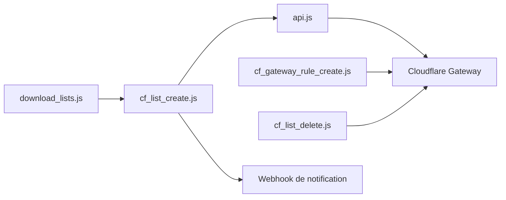

# mrrfv/cloudflare-gateway-pihole-scripts

> Scripts Node qui reproduisent un filtrage façon Pi-hole avec Cloudflare Gateway, sans serveur à maintenir.

## Le problème
Pi-hole demande un Raspberry Pi et une configuration complexe hors du domicile ; NextDNS coupe son filtrage gratuit après 300 000 requêtes par mois.

## Ce que ça fait vraiment
- Télécharge des listes de blocage et d'autorisation, supprime doublons, domaines invalides et commentaires.
- Crée dans Cloudflare Gateway des listes de domaines puis une règle qui bloque ce qui y correspond.
- Scripts de suppression, de défragmentation et de notification (webhook Discord, ping de santé).
- Filtrage SNI expérimental, via le client WARP ; exécution possible par GitHub Actions.

## Comment c'est branché


## Essayer
```bash
npm install
cp .env.example .env
node download_lists.js
node cf_list_create.js
node cf_gateway_rule_create.js
```

## Coût et pièges
Compte Cloudflare Zero Trust (plan gratuit suffisant) avec carte ou PayPal exigé, jeton d'API, identifiant de compte. Limite de 300 000 domaines en gratuit. `DRY_RUN=1` ne couvre que `cf_list_create.js`. Le README déconseille le fork public pour GitHub Actions.

## Ce que ce n'est pas
Ni un résolveur DNS auto-hébergé, ni une protection antimalware : les listes par défaut ciblent pubs et traqueurs. Dépend entièrement de Cloudflare.

## Alternatives
Pi-hole ou AdGuard Home : auto-hébergés, mais demandent un serveur. NextDNS : plafond de 300 000 requêtes par mois en gratuit.

## Pour toi
À surveiller : pratique pour filtrer le DNS de tes machines sans serveur, mais sans rapport avec ton métier data/MLOps et dépendant d'un seul mainteneur et d'un SaaS.

