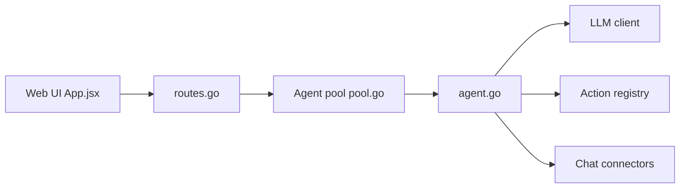

# mudler/LocalAGI

> Plateforme auto-hébergée pour créer des agents IA sans code, tournant en local avec LocalAI.

## Le problème
Monter des agents avec mémoire, connecteurs et outils sans dépendre d'API cloud ni écrire du Python.

## Ce que ça fait vraiment
Interface web pour configurer des agents : connecteurs (Discord, Slack, Telegram, GitHub Issues, IRC, e-mail), base de connaissances RAG intégrée, tâches périodiques, actions Go interprétées, serveurs MCP, Skills au format skillserver. Chaque agent expose l'API Responses d'OpenAI. Utilisable comme bibliothèque Go et il expose aussi son propre MCP sur `/mcp`.

## Comment c'est branché


## Essayer
```bash
git clone https://github.com/mudler/LocalAGI
cd LocalAGI
docker compose up
# NVIDIA : docker compose -f docker-compose.nvidia.yaml up
# interface sur http://localhost:8080
```

## Coût et pièges
Gratuit ; modèles locaux (ex. gemma-3-4b-it-qat par défaut), GPU conseillé pour multimodal et images. Tokens de connecteurs à gérer, ce qui élargit la surface d'attaque.

## Ce que ce n'est pas
Pas « 100 % local » dès que tu branches Slack ou GitHub ; les actions Go personnalisées s'exécutent sans bac à sable décrit.

## Alternatives
LocalAI et LocalRecall : briques du même écosystème, nommées dans le README.

## Pour toi
À surveiller : pratique pour prototyper des agents locaux avec MCP et RAG ; vérifie l'isolation avant d'y confier des actions sensibles.

