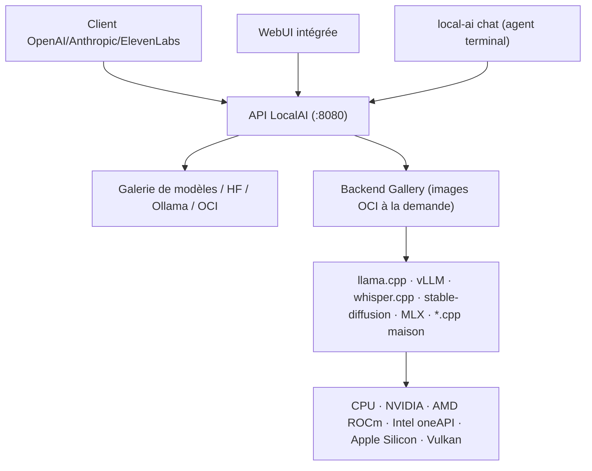

# mudler/LocalAI

> Moteur d'inférence local multimodal exposant une API compatible OpenAI, pour qui refuse le cloud.

## Le problème
Faire tourner du LLM, du TTS, de l'ASR et de la génération d'images en local oblige à empiler llama.cpp, whisper.cpp, vLLM et diffusers, chacun avec ses dépendances.
Et le code applicatif doit être réécrit à chaque changement de moteur.

## Ce que ça fait vraiment
Un petit cœur Go et des backends séparés, chacun dans son image OCI, téléchargée seulement quand un modèle en a besoin.
Il expose les APIs OpenAI, Anthropic et ElevenLabs sur tous les backends : texte, vision, audio, image, vidéo, embeddings, reranker, détection d'objets.
Les modèles se chargent depuis une galerie interne, Hugging Face, le registre Ollama, un YAML distant ou une image OCI.
Autour : WebUI, auth par clé d'API, quotas par utilisateur, mode distribué (PostgreSQL + NATS), MCP, agents intégrés avec RAG et outils.

## Comment c'est branché


## Essayer
```bash
# CPU seul
docker run -ti --name local-ai -p 8080:8080 localai/localai:latest

# GPU NVIDIA (CUDA 12)
docker run -ti --name local-ai -p 8080:8080 --gpus all localai/localai:latest-gpu-nvidia-cuda-12

# Charger un modèle depuis la galerie
local-ai run llama-3.2-1b-instruct:q4_k_m

# Depuis Hugging Face
local-ai run huggingface://TheBloke/phi-2-GGUF/phi-2.Q8_0.gguf

# Agent terminal contre un serveur déjà lancé
local-ai chat --model llama-3.2-1b-instruct:q4_k_m
```

## Coût et pièges
Gratuit et local, mais chaque backend est une image OCI supplémentaire : l'espace disque et la RAM montent vite dès qu'on mélange les modalités.
Le DMG macOS n'est pas signé par Apple et exige `sudo xattr -d com.apple.quarantine` après installation.

## Ce que ce n'est pas
Ce n'est pas un modèle : LocalAI n'apporte aucun poids, il orchestre des moteurs et te laisse choisir les checkpoints.
Ce n'est pas un bundle monolithique — sans backend téléchargé, rien ne tourne, et la première requête d'une modalité neuve paie le pull.
La compatibilité « drop-in » avec l'API OpenAI reste une réimplémentation : les fonctions les plus récentes ne sont pas garanties.

## Alternatives
llama.cpp : si tu ne veux que du texte GGUF, sans la couche d'orchestration.
vLLM : si tu sers un seul modèle à fort débit sur GPU, plutôt qu'un catalogue multimodal.
Ollama : le registre de modèles est directement consommable par LocalAI, donc c'est autant un complément qu'un concurrent.

## Pour toi
La bonne brique si tu veux un endpoint OpenAI-compatible sur ton infra pour prototyper sans facture d'API ; à évaluer sur la latence avant tout usage sérieux.
