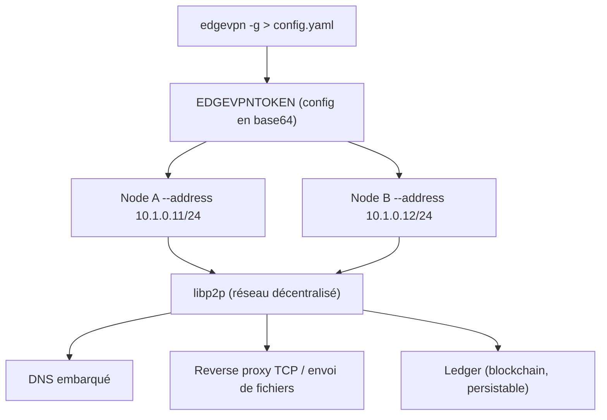

# mudler/edgevpn

> VPN et reverse proxy pair-à-pair sans serveur central, pilotés par un simple jeton partagé.

## Le problème
Relier des machines derrière des NAT impose soit un serveur central à maintenir, soit un
service type ngrok avec sa dépendance et son abonnement.

## Ce que ça fait vraiment
S'appuie sur libp2p pour bâtir des réseaux privés décentralisés accessibles par secret
partagé. Il monte un VPN entre pairs avec attribution automatique d'IP et un petit serveur DNS
embarqué ; il expose un service TCP en reverse proxy vers le réseau p2p, comme ngrok mais sans
infrastructure ; il envoie des fichiers en p2p sans établir de VPN ; et il s'utilise comme
bibliothèque Go pour embarquer un registre distribué (c'est ce qui alimente les fonctions P2P
de LocalAI). Des zones de confiance restreignent les pairs autorisés — le README précise
qu'elles sont expérimentales et n'empêchent pas aujourd'hui un porteur de jeton d'entrer. Une
interface web React est compilée dans le binaire, et une GUI desktop Linux existe en alpha.

## Comment c'est branché


## Essayer
```bash
curl -sfL https://raw.githubusercontent.com/mudler/edgevpn/master/install.sh | sh
edgevpn -g > config.yaml
EDGEVPNTOKEN=$(edgevpn -g -b)
EDGEVPNTOKEN=.. edgevpn --address 10.1.0.11/24
make build            # builds the UI if needed, then the Go binary
mkdir -p api/react-ui/dist && touch api/react-ui/dist/index.html
```

## Coût et pièges
Gratuit, binaire statique. **Le README avertit deux fois que le logiciel n'a pas subi d'audit
de sécurité complet** et déconseille les trafics sensibles et la production. L'approche
décentralisée est bavarde et mal adaptée aux charges à faible latence. L'établissement des
connexions peut prendre plusieurs minutes. Le fichier de configuration équivaut au contrôle
total du réseau : le diffuser, c'est tout donner. Compiler demande Node 20.19+ pour l'UI
embarquée par `//go:embed`.

## Ce que ce n'est pas
Ce n'est pas un produit audité ni supporté : l'auteur le présente comme sa première
expérimentation libp2p. Ce n'est pas un remplaçant de Tailscale ou WireGuard en entreprise.
Les zones de confiance ne sont pas encore une barrière réelle.

## Alternatives
- ngrok, cité comme la référence dont l'auteur voulait une version « plus ouverte » et sans
  infrastructure à maintenir.

## Pour toi
Astucieux pour un cluster k3s de test entre machines chez toi ; à ne pas mettre en production.
