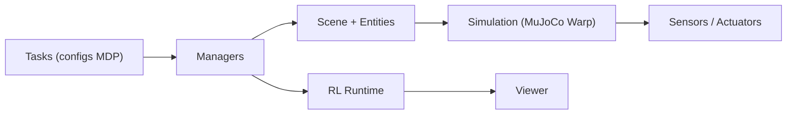

# mujocolab/mjlab

> Environnements d'apprentissage par renforcement en robotique, API à la Isaac Lab sur MuJoCo Warp.

## Le problème
Entraîner des politiques de robots demande beaucoup d'environnements simulés en parallèle sur GPU, avec des définitions de tâches composables.

## Ce que ça fait vraiment
Reprend l'API « manager-based » d'Isaac Lab (actions, observations, récompenses, terminaisons, événements) et l'exécute sur MuJoCo Warp. Tâches fournies : vitesse, imitation de mouvement, manipulation, cartpole ; robots Unitree G1/Go1 et i2rt_yam. Entraînement multi-GPU, capteurs, actuateurs, terrains, visionneuse viser. macOS ne sert qu'à l'évaluation.

## Comment c'est branché


## Essayer
```bash
uvx --from mjlab --refresh demo
git clone https://github.com/mujocolab/mjlab.git && cd mjlab
uv run train Mjlab-Velocity-Flat-Unitree-G1 --env.scene.num-envs 4096
uv run play Mjlab-Velocity-Flat-Unitree-G1 --wandb-run-path your-org/mjlab/run-id
```

## Coût et pièges
GPU NVIDIA obligatoire pour entraîner. Suivi des runs via Weights & Biases. Une partie du code vient d'Isaac Lab (BSD-3, en-têtes conservés).

## Ce que ce n'est pas
Pas un simulateur : il s'appuie sur MuJoCo Warp. Pas de RL généraliste hors robotique.

## Alternatives
Isaac Lab (dont il reprend l'API), cité dans le README.

## Pour toi
Surveiller : la démo sans installation coûte peu, mais l'intérêt est réel seulement si tu fais de la robotique par RL.
