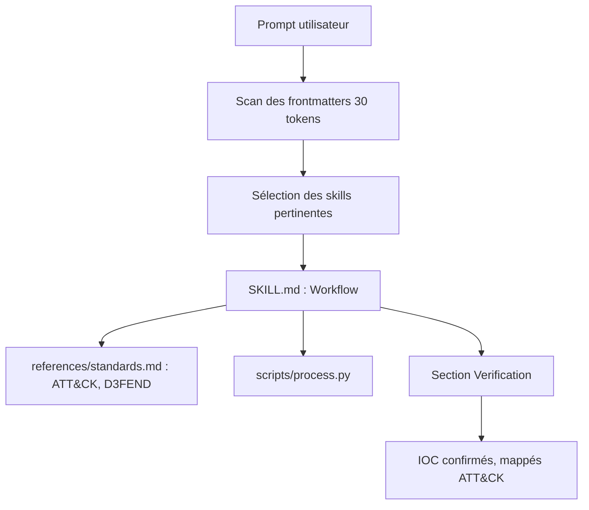

# mukul975/Anthropic-Cybersecurity-Skills

> Bibliothèque communautaire de 818 skills cybersécurité structurées pour agents IA, mappées à six référentiels.

## Le problème
Un agent généraliste sait écrire du code et chercher sur le web, mais ignore quel plugin Volatility3 lancer sur un dump mémoire.
Les dépôts existants fournissent des wordlists ou des exploits, pas le processus de décision d'un analyste.

## Ce que ça fait vraiment
818 skills sur 34 domaines (cloud, SOC, threat hunting, forensique, IAM, malware, red team, conteneurs, OT/ICS, API, IR…), au standard ouvert agentskills.io.
Chaque skill est un dossier : `SKILL.md` avec frontmatter YAML et corps Markdown (When to Use, Prerequisites, Workflow, Verification), plus `references/`, `scripts/` et `assets/`.
Mapping vers six référentiels selon la nature de la skill : MITRE ATT&CK v19.1 (805 skills), NIST CSF 2.0 (804), D3FEND (139), NIST AI RMF (97), MITRE F3 (94), ATLAS (93).
Divulgation progressive : environ 30 tokens pour scanner un frontmatter, 500 à 2 000 pour charger le workflow complet, ce qui permet de balayer toute la bibliothèque en une passe.

## Comment c'est branché


## Essayer
```bash
npx skills add mukul975/Anthropic-Cybersecurity-Skills
```

```bash
git clone https://github.com/mukul975/Anthropic-Cybersecurity-Skills.git
cd Anthropic-Cybersecurity-Skills
```

## Coût et pièges
Gratuit, Apache-2.0 sur les skills. Aucun coût d'exécution hors tokens de votre agent.
Contenu offensif et dual-use (C2 red team, simulation de phishing, exploitation) : usage strictement autorisé, sur des systèmes que vous possédez ou avec accord écrit.

## Ce que ce n'est pas
Ce n'est pas un projet Anthropic malgré le nom : le README le signale d'emblée comme indépendant et communautaire.
Ce n'est ni une collection de scripts ni un scanner : ce sont des playbooks textuels que l'agent suit.
Les compteurs sont incohérents entre eux (817 ou 818 selon les sections) et un encart promotionnel (sondage, playground Casky.ai) occupe une partie du README.

## Alternatives
Le README ne nomme pas de concurrent ; il cite les index où il figure (VoltAgent/awesome-agent-skills, ottosulin/awesome-ai-security).

## Pour toi
À piocher pour la forme des skills — frontmatter, Workflow, Verification — plus que pour le contenu sécurité lui-même.
